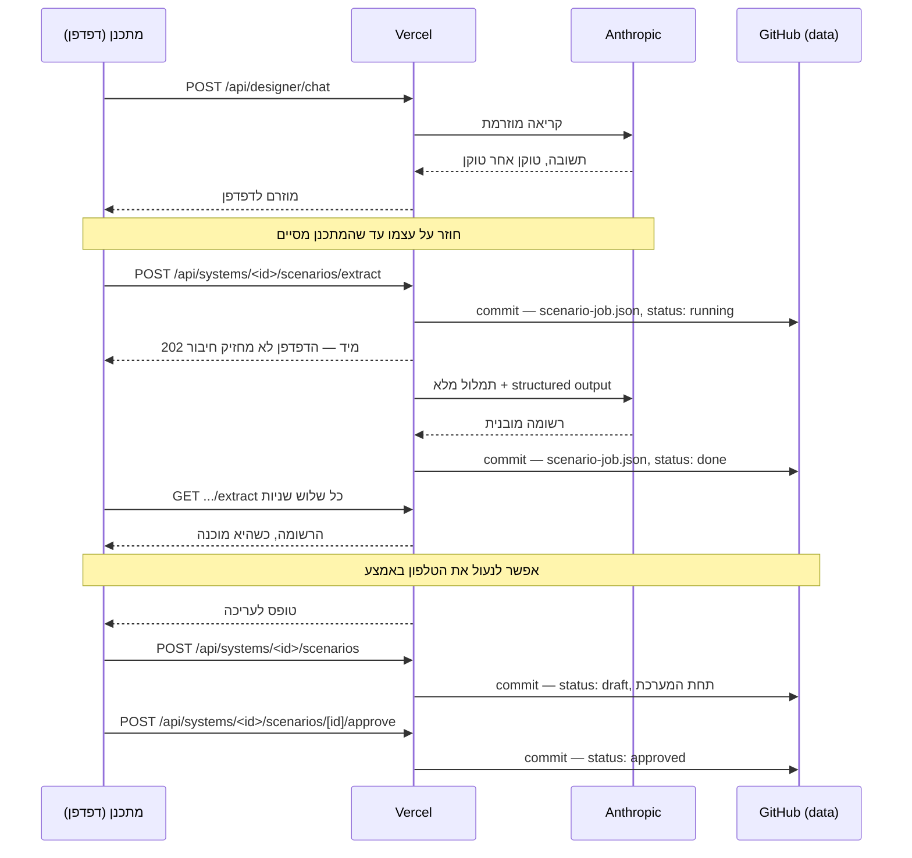
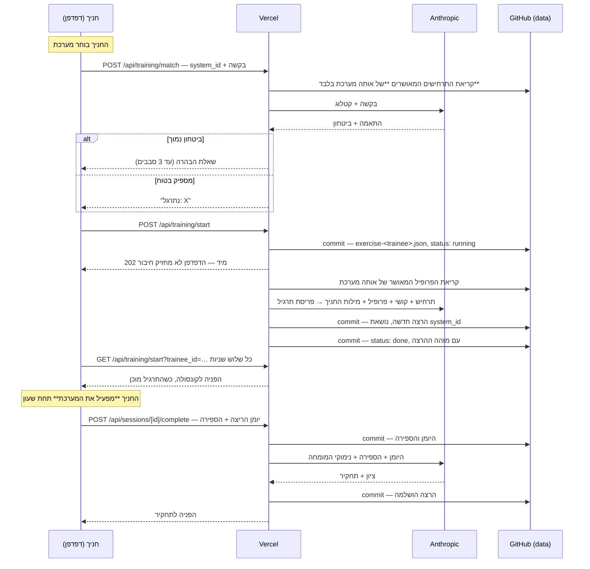

# ארכיטקטורת הפרויקט

מסמך ייחוס לסימולטור האימון להגנה אווירית. מתאר מה רץ איפה, איך המידע זורם,
איפה הוא נשמר, ולמה ההחלטות התקבלו כך.

### נספחים

שלושה מסמכים יורדים לעומק של נושא אחד. הם מקושרים גם מהפרק ששייך להם, ומרוכזים
כאן כי נספח שאפשר למצוא רק במקום אחד הוא נספח שלא נמצא:

| מסמך | על מה, ומאיזה פרק |
|---|---|
| [`docs/profile-requirements.md`](docs/profile-requirements.md) | מה חייב להיות מלא בפרופיל כדי שהסימולציה תרוץ — שדה־שדה. פרק 3 |
| [`docs/console-review.md`](docs/console-review.md) | איפה בקשת שינוי בקונסולה נגמרת, ולמה השמורה לא נוגעת עד האישור. פרק 5 |
| [`docs/next-project-prompt.md`](docs/next-project-prompt.md) | פרומפט להעתקה כשמקימים אפליקציה דומה בפעם הבאה. פרק 9 |

---

## 1. שלושת השירותים

המערכת מורכבת משלושה שירותים חיצוניים בלבד. אין מסד נתונים ואין שרת קבצים.

| שירות | תפקיד | מה נשמר שם |
|---|---|---|
| **GitHub** | מאחסן את הקוד **וגם את כל המידע** | קוד המקור, דילמות, מרשם חניכים, כל הרצת אימון |
| **Vercel** | מריץ את האפליקציה | שום מידע. רק הסודות, כמשתני סביבה |
| **Anthropic API** | מנוע ה-AI | שום דבר. כל קריאה עומדת בפני עצמה |

**העיקרון המרכזי:** Vercel היא רק מנוע הרצה. אם היא נמחקת מחר, שום מידע לא הולך
לאיבוד — הכל יושב בגיטהאב. אפשר לחבר פלטפורמה אחרת ולהמשיך.

### למה אין מסד נתונים

Vercel מריצה קוד ב-serverless: אין דיסק לכתיבה, וכל בקשה עלולה לרוץ על מכונה
אחרת. לכן קובץ SQLite מקומי לא היה שורד. במקום להוסיף שירות רביעי (Turso,
Postgres), הכל נכתב לגיטהאב דרך ה-API שלו — מנגנון אחסון אחד לכל המערכת, בלי
הרשמות ובלי סודות נוספים לתחזק.

**המחיר:** כתיבה לוקחת כשנייה, והרצת אימון אחת יוצרת שלושה קומיטים.
**התמורה:** היסטוריה מלאה וניתנת לבדיקה של הידע המבצעי ושל כל אימון שנגזר ממנו.

---

## 2. שלושת הענפים

| ענף | תוכן | מי כותב אליו |
|---|---|---|
| `main` | **הקוד.** Vercel בונה מכאן | מיזוגים מענף הפיתוח |
| `claude/air-defense-simulator-bwmstp` | ענף פיתוח | Claude, בזמן עבודה |
| `data` | **כל המידע** שהאפליקציה שומרת | האפליקציה עצמה, בזמן ריצה |

### למה המידע בענף נפרד

Vercel בונה מחדש בכל דחיפה ל-`main`. אילו האפליקציה הייתה כותבת את ההרצות
לשם, **כל אימון היה מפעיל שלוש בניות מחדש** — שריפת מכסת בנייה ורעש מיותר.

הפרדת המידע לענף `data` מנתקת את הקשר: המידע נשמר בגיטהאב כמו שנדרש, והבנייה
מופעלת רק כששינוי קוד אמיתי מגיע ל-`main`.

הענף שאליו האפליקציה כותבת נקבע ע"י משתנה הסביבה `GITHUB_BRANCH`.

---

## 3. מבנה המידע בענף `data`

```
data/
├── kb/
│   └── systems/
│       └── <system-id>/         ← מערכת מדומה אחת
│           ├── system.json      ← זהות: שם, הערה, מתי נוצרה
│           ├── profile.json     ← איך היא מתנהגת
│           ├── gui.json         ← תבנית הקונסולה שלה, כפי שאושרה
│           ├── gui-job.json     ← הבנייה האחרונה של הקונסולה, כולל הבקשות שענתה עליהן
│           ├── screenshots/     ← צילומי הייחוס, נקראים פעמיים
│           ├── scenarios/
│           │   └── <uuid>.json  ← תרחיש שנלמד בתוך המערכת הזו, והדילמות שבו
│           └── exercises/
│               └── <uuid>.json  ← תרגיל בספרייה: פריסה אחת, ושרשור התיקונים שלה
├── sessions/
│   └── <uuid>.json              ← הרצת אימון אחת לקובץ, כולל מזהה המערכת
├── jobs/
│   └── <kind>-<key>.json        ← עבודת רקע שהדפדפן לא מחכה לה (פרק 8)
└── trainees.json                ← מרשם החניכים
```

**תרחיש ותרגיל אינם אותו דבר, וההפרדה הזו נושאת משקל.** תרחיש (`scenarios/`)
הוא המצב והדילמות שהמתכנן החליט ששייכות לו — מופשט, ואינו נושא מספרים. תרגיל
(`exercises/`) הוא פריסה קונקרטית אחת של תרחיש: כמה טרקים, מאיפה, באיזו מהירות,
ומתי כל אחד מגיע. אותו תרחיש מייצר תרגיל אחר בכל פעם.

### למה כל מערכת בתיקייה משלה

**המערכות עצמאיות זו מזו.** אפשר להחזיק כמה מערכות מדומות במקביל, ולהתחיל
מערכת שנייה לפני שהראשונה הושלמה. כל מה שהגיוני רק בתוך מערכת מסוימת יושב
תחתיה.

**דילמה שייכת למערכת, ולא למאגר משותף.** המספרים שלה, מצבי הזיהוי שהיא מניחה
והפעולות שהיא מציעה נכונים רק בתוך מערכת אחת. דילמה שנלמדה על מערכת א׳ לעולם
לא תוצע כשמתאמנים על מערכת ב׳ — אחרת החניך היה מתאמן על נוהל שהקונסולה שלו לא
מכירה. לכן **החניך בוחר מערכת לפני שהוא מבקש אימון**, וההתאמה מחפשת רק בדילמות
המאושרות של אותה מערכת.

**ההפרדה גם זולה יותר לקריאה:** רשימת הדילמות של מערכת אחת היא קריאת תיקייה
אחת, ולא סריקה של כל הדילמות בריפו.

**השם הוא של המתכנן, לא של המודל.** הוא ניתן בעת יצירת המערכת, מופיע בקונסולה
ובכל פרומפט, והמודל לא ממציא ולא משנה אותו.

### מה יש בפרופיל המערכת

הקובץ הזה הוא **התשתית שכל השאר עומד עליה**. דילמה היא שיקול דעת *בתוך* מערכת,
ולכן אי אפשר ללמד דילמות לפני שהמערכת עצמה מתוארת. בלי הפרופיל המודל ממציא
מערכת הגנה אווירית: הוא מנחש אילו סיווגים קיימים, מה הופך נתיב לעוין, ומה
המפעיל רשאי לעשות — והתרחישים שיוצאים **נראים נכון בלי להיות נכונים**. זה מצב
הכשל הגרוע ביותר במאמן, כי אף אחד לא רואה אותו.

| שדה | תפקיד |
|---|---|
| `purpose` | מה המערכת מגנה עליו ומפני מה. **השם אינו כאן** — הוא ב-`system.json`, ניתן ע"י המתכנן |
| `track_classifications[]` | כל סוג נתיב שהמפעיל מבחין בו, עם תחומי מהירות וגובה, ו-`transponder` — מה הסוג הזה משיב לתשאול (`none` / `civil` / `military`). **התרחיש מוגבל לרשימה הזו** |
| `iff_states[]` | מצבי הזיהוי הקיימים, מה מכניס נתיב לכל אחד, ו-`tone` שממפה אותו לצבע בקונסולה |
| `iff_interrogation` | **האם למערכת יש משאל IFF בכלל**, ואילו אופנים היא קוראת. כבוי כברירת מחדל, ואז אין בקונסולה פקודת תשאול. פירוט בהמשך |
| `operator_commands` | **אילו פקודות יש לקונסולה הזו** מעבר לארבע שיש לכולן. כל אחת היא חוק במנוע שהפרופיל מדליק — לא כפתור. פירוט בהמשך |
| `track_readout_fields[]` | **עמודות התצוגה**, בסדר ובניסוח של המערכת האמיתית. **טבלת הטרקים החיה נבנית מהן** — הכותרות והתאים כאחד. ראה בהמשך |
| `sensor` | **מה המכ"ם רואה** — טווח גילוי, אזור מת קרוב, זווית כיסוי (360° למכ"ם מסתובב, 120° למערך קבוע) וסרגל גובה. שונה מטווח הירי: הגילוי קובע כמה התרעה יש למפעיל, והזווית קובעת אם יש התרעה בכלל מכיוון מסוים |
| `engagement` | מעטפת הירי: טווח מזערי ומרבי, זמן טיסה, ומי מוסמך לאשר. **בנוסף שלושה מספרים שהסימולציה אוכפת**: `interceptors[]` (סוגי המיירטים עם טווח ומהירות לכל אחד), `max_simultaneous` (כמה באוויר בו־זמנית — שיגור נוסף נדחה), ו-`magazine_depth`. עד שהסימולטור נבנה הם היו משפט בפרוזה, וזה הספיק כל עוד הריצה הייתה שאלון; "לא יותר משני רקטות באוויר" חייב להיות מספר לפני שמשהו יכול לעצור שיגור שלישי |
| `operator_responsibilities[]` | מה המפעיל מחליט, **בפרוזה**. רק מכאן נגזרות נקודות ההכרעה — אבל טקסט חופשי אפשר רק לתאר, לא להריץ. מה שהסימולטור באמת מבצע יושב ב-`operator_commands` |
| `automatic_functions[]` | מה המערכת עושה לבד. תרחיש לא יבקש מהחניך לעשות את זה, והקונסולה לא תציג לזה כפתור |
| `workflow_steps[]` | סדר הפעולות בפועל — קובע כמה מקום נדרש בפאנל ההכרעה |
| `source_answers[]` | התשובות המקוריות של המתכנן, לביקורת |
| `approved` | **רק פרופיל מאושר מנהל ייצור תרחישים.** טיוטה = המתכנן עדיין באמצע |
| `id` | זהה למזהה המערכת — פרופיל אחד לכל מערכת |

> **את הטופס אי אפשר לסיים בלי המספרים שהסימולציה רצה עליהם** — טווח גילוי,
> זווית כיסוי, סוגי נתיבים עם תחומי מהירות, מצבי זיהוי (אחד עוין לפחות ואחד
> שאינו), עמודות תצוגה, טווח ירי מרבי, סוגי מיירטים, כמה באוויר בו־זמנית,
> ועומק מחסנית. למנוע יש ברירת מחדל לכל אחד, **וזו בדיוק הסיבה שהם חובה**:
> בלעדיהם הריצה לא נשברת אלא ממשיכה על מספר שאף אחד לא בחר, התרגיל מפסיק
> להיות *המערכת הזו*, ושום דבר על המסך לא אומר את זה.
>
> הכלל ב-`domain/profile-readiness.ts`, בהגדרה אחת, ונאכף בשלושה מקומות: הטופס
> מסרב לסיים ומפרט מה חסר לפי סעיפים; מסלול החילוץ מסרב לפני קריאת המודל, כדי
> לא לשלם על מפרט שלא יאושר; ומסלול השמירה מסרב לאשר, כי כלל שנאכף רק בדפדפן
> הוא כלל שטאב ישן לא מכיר. שמירה כטיוטה נשארת פתוחה.
>
> **מה שלא נדרש נשאר לא נדרש:** אזור מת, סרגל גובה וכל הפרוזה. טופס שדורש מה
> שאדם לא יודע מתמלא במספרים מומצאים. פרופיל שאושר לפני הכלל נשאר מאושר, ודף
> הפרופיל אומר לו מה חסר ושעד אז הריצות על ברירות מחדל.
>
> הרשימה המלאה, על כל שדה ועל מה שנבדק מעבר לשדות ריקים:
> [`docs/profile-requirements.md`](docs/profile-requirements.md).

### IFF — מה נתיב משדר, ומי בכלל יכול לשאול

מטוס משיב לתשאול בקוד. **Mode 3/A** הוא ארבע ספרות אוקטליות, כל אחת `0`–`7`
— הקוד שפיקוח אווירי אזרחי מקצה, ומה שגם מטוס צבאי משתף פעולה משדר.
**Mode 1** הוא שתי ספרות, כל אחת `0`–`4`, קוד משימה צבאי: מקבל תשובה עליו
יודע משהו שקוד Mode 3 לבדו לא אומר. שני הכללים יושבים במקום אחד,
`lib/domain/iff-codes.ts`, כי ארבעה מקומות צריכים אותם — הטופס, מחולל
התרחישים, בדיקת המערכת והקונסולה.

חלק מהקודים אומרים דבר בזכות עצמם: `7500` חטיפה, `7600` תקל קשר, `7700`
מצוקה כללית, `1200`/`2000` אזרחי. הקונסולה מפרשת אותם לחניך, ו**המחולל
לעולם לא מגריל אותם** — קוד כזה בתרגיל הוא בחירה מכוונת של מי שבנה אותו.

שלוש החלטות שכדאי לזכור:

**התשאול הוא יכולת נפרדת מהמכ"ם, וכבויה כברירת מחדל.** יש לא מעט מערכות
שרואות נתיב בלי יכולת לשאול אותו דבר, ומפעיל על מערכת כזו מזהה לפי התנהגות
בלבד — מקצוע אחר, וכזה ששווה לאמן בכוונה. מערכת שלא הצהירה על משאל לא
מקבלת עמודת IFF ולא מקבלת פקודת תשאול; הצהירה — הטופס שואל אילו אופנים היא
קוראת, ומה כל סוג נתיב משיב.

**הצהרת הסוג מחייבת.** סוג שסומן "אינו משיב" לא יקבל קוד מהמודל בשום מצב.
בלי הכלל הזה נפתחת דרך עקיפה לזהות טיל שיוט על ידי תשאול שלו, וזה בדיוק
הקיצור שהאימון אמור לסגור, לא לפתוח.

**שלושה מצבים בעמודה, לא שניים.** `·` = לא תושאל, `NO RPLY` = תושאל ושתק,
והקוד עצמו = תושאל והשיב. תא ריק לשני המצבים הראשונים היה אומר למפעיל
שנתיב סירב להשיב כשאף אחד לא שאל אותו — וזו בדיוק הטעות שיקרה ביותר להטמיע
בהרגלים של מפעיל. כל תשאול נרשם ביומן הריצה כסוג אירוע בפני עצמו, כך
שהתחקיר רואה גם עבודת זיהוי שנעשתה, וגם נתיב שנורה בלי שתושאל אף פעם
במערכת שיכלה לתשאל אותו. **"אין תשובה" מעולם לא היה הוכחה לעוינות**, והפרומפט
של התחקיר אומר את זה במפורש.

### עמודות הטרקים — הטבלה נבנית ממה שהוצהר

**`track_readout_fields[]` נקרא פעמיים, ובמשך זמן רק אחת מהן עבדה.** שלד
הקונסולה קיבל את העמודות כהוראת פריסה, ואז טבלת הטרקים החיה ציירה לתוך אותו
שטח ארבע עמודות קשיחות משלה. מתכנן יכול היה להצהיר על IFF, גובה או סטטוס ירי
ולא לראות כלום — ושום דבר על המסך לא אמר אם העמודה הוזנחה או שהערך חסר.
**הטבלה נבנית מהרשימה הזו עכשיו**, כותרות ותאים כאחד, לפי הסדר שהמתכנן קבע.

הסימולציה יודעת לגזור ערך לתוויות האלה (התאמה לפי התווית עצמה, באותיות
גדולות): `TRK`, `TYPE`/`CLASS`, `AZ`/`BRG`, `RNG`, `ALT`, `SPD`, `TTI`, `ID`,
`IFF`, `MODE 1`, `PK`, `FIRE STATUS`. **עמודה מחוץ לרשימה עדיין מוצגת** — זו
הקונסולה של המתכנן והוא עשוי לדעת למה — אבל עם מקף והסבר בריחוף, כי תא ריק
נקרא כערך של כלום ולא כמספר שהסימולטור לא מחזיק.

`SimConfig.readouts` הוא המקום היחיד שמחליט את זה. פרופיל בלי עמודות מקבל
ארבע ברירת מחדל — `TRK`, `RNG`, `TTI`, `ID`, המינימום שקונסולה לא נקראית
בלעדיו — ופרופיל שהצהיר על עמודות משלו **מחליף אותן לגמרי**, כולל לוותר על
כל אחת מהארבע.

### מה המפעיל יכול לעשות — הצהרה, לא תיאור

**ארבע פקודות קיימות בכל מערכת** ואינן מוצהרות: בחירת טרק, שינוי הזיהוי, ירי,
והפסקת אש. כל השאר הוא יכולת שיש למערכות מסוימות ואין לאחרות, ו-
`operator_commands` בפרופיל הוא מה שמדליק אותה.

**למה זה קיים בכלל.** `operator_responsibilities` כבר שאל את המתכנן מה המפעיל
מחליט — והוא `z.array(z.string())`, כלומר טקסט חופשי. אפשר היה רק **לתאר** בו.
הפרופיל החי של המערכת בריפו הזה מצהיר "בוחר מאיזה משגר לירות" ו"מכוונן את
ה-tilt של המכ״ם", והסימולטור לא ידע על כך דבר: התשובה נרשמה, נמסרה לבונה
הקונסולה, והייתה בלתי־שמישה בשקט. **זה בדיוק הכשל של עמודת IFF ריקה, קומה
אחת למטה** — המסך שואל שאלה שאין לו יכולת לכבד. וזו הסיבה היחידה שבקשה כמו
"תוסיף כפתור טעינה" הייתה חייבת לעבור דרך שינוי קוד.

| פקודה | מה היא באמת עושה | המספר שהיא רצה עליו |
|---|---|---|
| `retype` | המפעיל מתקן את **סוג** הטרק שהקונסולה מציגה. ל-`RuntimeTrack` יש `displayed_classification` לצד האמת, בדיוק כמו במודל ה-IFF | — (צריך שני סיווגים לפחות) |
| `reload` | ממלא **משגר אחד** מחדש, על השעון. נדחית כשלמשגר יש רקטה באוויר, כשהוא כבר נטען, וכשהוא מלא | `reload_seconds` |
| `launchers` | המפעיל בוחר מאיזה משגר לירות. **המחסנית מתחלקת ביניהם** | `launcher_count` (2+) |
| `tilt` | כיוון האלֶוַציה של מערך קבוע. מה שמתחת לאלומה **לא מוחזק בכלל** | `tilt_min_deg`, `tilt_max_deg` |

שלושה כללים שכדאי לזכור:

**טעינה עולה את הזמן שהיא אומרת שהיא עולה.** השעון לא נעצר, וזה כל הלקח: טעינה
אינה כפתור שמבטל מחסור, היא החלטה לבזבז שניות שהטרק הבא משתמש בהן כדי להתקרב.
מנגנון שטוען מיידית מלמד מפעיל שטעינה חינם.

**ריבוי משגרים מוסיף החלטה, לא רקטות.** `magazine_depth` נשאר הסך הכל ומתחלק
בין המשגרים (השארית לראשונים), כך שהדלקת הפקודה לא מנפחת אף תרגיל קיים.

**`viewOf` מקבל את ה-tilt כארגומנט חובה, לא אופציונלי.** הנראות נקבעת במקום
אחד כדי שהמכ״ם, רשימת הטרקים וחוקי הירי לא יוכלו לחלוק זה על זה — וארגומנט
שאפשר לשכוח הוא בדיוק איך הם היו מתחילים לחלוק. מערכת בלי מערך מתכוונן פשוט
מתעלמת ממנו.

**פקודה שהודלקה בלי המספר שהיא רצה עליו נחשבת כבויה, ולא מנוחשת.** הכפתור לא
מופיע, ו-`profile-readiness` אומר למתכנן למה תחת הכותרת "מה המפעיל יכול לעשות".

**וגם: מה שלא הוצהר — אין לו כפתור.** לא כפתור שלא עושה כלום. הבונה של
הקונסולה מקבל את `operator_commands` ומורה לו לומר איפה המתג נמצא במקום לצייר
בקרה מתה. *(עדיין קיים: שלד קונסולה שנבנה לפני זה עלול להחזיק תוויות סטטיות
כמו `RADAR TILT` שהבונה צייר מהפרוזה. הבקרה החיה היא האמת; בנייה מחדש של
הקונסולה מנקה את הטקסט.)*

### מה יש בקובץ תרחיש

| שדה | תפקיד |
|---|---|
| `title`, `sub_domain_tag` | זיהוי |
| `trigger_conditions` | **משטח ההתאמה** — הטקסט שמנוע ההתאמה קורא כדי להחליט אם בקשת חניך מתאימה לתרחיש הזה |
| `key_variables` | הטווחים שבתוכם נפרס כל תרגיל: מספר איומים, חלון זמן, רמות ודאות IFF, משאבים |
| `decision_points[]` | נקודות ההכרעה. לכל אחת: מצב, פעולות אפשריות, הפעולה המועדפת, **הנימוק**, וטעויות נפוצות |
| `difficulty_scaling` | איך אותו תרחיש מתהדק בקל/בינוני/קשה |
| `evaluation_criteria` | מה נחשב הצלחה, ואיך מנקדים |
| `status` | `draft` או `approved` — **רק מאושרות נגישות לחניכים** |
| `system_id` | **המערכת שבתוכה נלמד.** רק היא תציע את התרחיש הזה |
| `source_chat_log` | תמלול שיחת הלימוד המקורית, לביקורת |

> **`rationale` ו-`common_errors` הם חומר הגלם של התחקיר.** התחקיר מצטט אותם
> מילה במילה לחניך. שדה מעורפל שם מייצר תחקיר חסר ערך — וזה לא נראה כמו באג,
> אלא כמו AI לא מוצלח.

---

## 4. נקודות המגע עם ה-AI

לכל אחת **system prompt נפרד ומשלה**. אין פרומפט כללי אחד.

| # | מודול | קלט | פלט |
|---|---|---|---|
| 1 | `learn-system.ts` | שלוש שאלות פתוחות + הסעיף הפתוח + **צילומי המסך**. הסעיפים המספריים נמסרים כהקשר בלבד | חצי הפרוזה של הפרופיל |
| 2 | `learn-scenario.ts` — ראיון | שיחה חופשית | תשובה מוזרמת. **אף פעם לא JSON** |
| 3 | `learn-scenario.ts` — חילוץ | תמלול מלא | רשומת תרחיש מובנית |
| 4 | `match-scenario.ts` | בקשת חניך + קטלוג | id + רמת ביטחון + שאלת הבהרה |
| 5 | `generate-exercise.ts` | תרחיש + רמת קושי + **פרופיל המערכת** + **מילות החניך** | **מערך יירוט לריצה** — מסלולים, מהירויות וזמני הופעה |
| 5ב | `generate-exercise.ts` — תיקון | התרגיל הקיים + **כל** בקשות המתכנן, מהוותיקה לחדשה | תרגיל מתוקן, לאישור |
| 6 | `generate-gui.ts` | צילומי מסך + **פרופיל המערכת** (כולל `operator_commands`) + בקשות השינוי של המתכנן | שלד HTML של הקונסולה |
| 7 | `debrief.ts` | **יומן הריצה** + הספירה + הידע + **מה החניך ביקש** | ציון + טקסט תחקיר |

### שלוש החלטות שכדאי לזכור

**למה הפרופיל נאסף בטופס ולא בשיחה, ולמה הטופס מפוצל לשניים (1).** דילמה חיה
בשיקול הדעת של המומחה וצריך לחלץ אותה בשיחה; התנהגות המערכת היא **מפרט**,
ומפרט עדיף לבקש ישירות. בתוך הטופס עצמו יש חלוקה נוספת, והיא העיקר:

- **מה שנמדד** — כיסוי המכ"ם, סוגי הנתיבים והתחומים שלהם, עמודות התצוגה
  ומעטפת הירי — מוזן ישירות לשדות **ואף פעם לא מגיע למודל**. מספר שהוקלד
  בתיבה אי אפשר לקרוא לא נכון, ולבקש ממודל לחלץ "5 עד 40 ק"מ" מתוך פסקה
  קונה רק סיכוי לטעות. הערך נשמר בדיוק כפי שהמתכנן הקליד אותו.
- **מה שמתואר** — למה המערכת נועדה, מה המפעיל מחליט, מה קורה בלעדיו וסדר
  הפעולות — נשאר פרוזה, כי שם אדם שכותב חופשי אומר יותר ממה שטופס היה יודע
  לשאול. הפיכת פרוזה לרשימות היא בדיוק מה שמודל טוב בו.

התוצאה גם זולה יותר: שלוש שאלות במקום שמונה, פחות טוקנים בכל כיוון, ופחות
צילומי מסך לקרוא — העמודות ומצבי הזיהוי כבר לא נלמדים מהתמונה.

**למה הלימוד מפוצל לשתי קריאות (2 ו-3).** מראיין שצריך להחזיק סכמת JSON בראש
תוך כדי שיחה הוא מראיין גרוע. הקריאה הראשונה רק מראיינת; השנייה קוראת את
התמלול ובונה את הרשומה — פעם אחת, בסוף.

**למה התחקיר כבול לבסיס הידע (7).** ה-system prompt קובע מפורשות שהנימוק של
המומחה הוא הסמכות — לא דעתו של המודל על הגנה אווירית. מודל שיטען טענה מנומקת
אך לא מאושרת ילמד את החניך משהו שהמומחה מעולם לא אישר.

### מצב Mock

בלי `ANTHROPIC_API_KEY` המערכת עוברת אוטומטית למצב דמה: כל המסכים עובדים
ולחיצים, וכל תשובת AI היא טקסט קבוע **המסומן ככזה**. מאפשר לבדוק את הזרימה
בלי לשרוף קרדיטים, ומונע מצב שבו מפתח חסר מתגלה כשגיאה סתומה.

---

## 5. זרימת מידע — הקמת מערכת מדומה

המתכנן קודם כל **נותן שם למערכת** — ומרגע זה היא קיימת, מופיעה ברשימה, ואפשר
לעבוד עליה. אחר כך רצף של חמישה שלבים, לכל מערכת בנפרד. **הסדר אינו המלצה:**
שלב 3 חסום עד ששלב 2 אושר ועד שיש צילומים, ושלב 4 מזהיר במפורש שתרחישים שייבנו
ממנו ירוצו מול מערכת מומצאת כל עוד הפרופיל לא אושר.

```mermaid
sequenceDiagram
    participant D as מתכנן (דפדפן)
    participant V as Vercel
    participant A as Anthropic
    participant G as GitHub (data)

    Note over D: 0. שם למערכת
    D->>V: POST /api/systems — שם + הערה
    V->>G: commit — systems/<id>/system.json
    V-->>D: הפניה לרצף ההקמה של המערכת הזו

    Note over D: 1. צילומי הייחוס
    D->>V: POST /api/systems/<id>/screenshots — 2–20 צילומים מוקטנים, מצטברים
    V->>G: commit — systems/<id>/screenshots/
    Note over V,G: הועלו פעם אחת, נקראים פעמיים

    Note over D: 2. איך המערכת מתנהגת
    D->>V: POST /api/systems/<id>/profile/extract — תשובות + סעיף פתוח + הסעיפים המספריים
    V->>G: קריאת הצילומים השמורים
    V->>A: תשובות + הצילומים כתמונות (המספרים כהקשר, לא לחילוץ)
    A-->>V: חצי הפרוזה; המספרים חוזרים כפי שהוזנו
    V-->>D: טופס לעריכה, שדה־שדה
    D->>V: POST /api/systems/<id>/profile — approved: true
    V->>G: commit — systems/<id>/profile.json

    Note over D: 3. הקונסולה המדומה
    D->>V: POST /api/systems/<id>/gui/generate — בקשות השינוי + הקונסולה הקודמת
    V->>G: קריאת הפרופיל המאושר והצילומים
    alt חסר פרופיל מאושר או צילומים
        V-->>D: 409 — מה חסר ואיפה להשלים אותו
    else יש
        V->>A: צילומים + פרופיל + כל בקשות השינוי, מהוותיקה לחדשה
        A-->>V: שלד HTML עם שישה data-slot
        V->>G: commit — התבנית והשיחה שהובילה אליה
    end
    Note over D: 4. בדיקת המערכת — מטרות באוויר, בלי חניך ובלי לכתוב כלום

    Note over D: 5. לימוד דילמות
    D->>V: ...ראה סעיף 6
```

### למה הצילומים לפני התיאור

שאלה 4 בשלב 2 מבקשת **את העמודות המדויקות, בסדר שהן מופיעות, עם היחידות**. זו
בקשה מהמתכנן לתעתק מהזיכרון משהו שהוא מסתכל עליו כל יום — כשהוא יכול פשוט
להראות אותו. אותו דבר בשאלת מצבי הזיהוי ובשאלת הפעולות.

לכן הצילומים שייכים **למערכת** ולא לשלב הקונסולה: מעלים אותם פעם אחת, והם
נקראים פעמיים — בזמן שהתשובות מפוענחות, ושוב כשהקונסולה נבנית. שלב הקונסולה
כבר לא מבקש העלאה בכלל.

**הצילום הוא ראיה על התצוגה, לא סמכות על המערכת.** צילום מראה **רגע אחד**, ולכן
הפרומפט אוסר במפורש: אסור להסיק שמצבי הזיהוי הנראים הם היחידים, אסור להסיק
שיכולת לא קיימת כי שום דבר לא משתמש בה כרגע, ואסור להוריד שדה מהפרופיל רק כי
לא הופיע. כפתור על המסך אומר שהמערכת יודעת לעשות משהו — **לא** שהמפעיל הוא זה
שמחליט; אחריות המפעיל נגזרת מהתשובות בלבד.

**במחלוקת בין צילום לתשובה — התשובה מנצחת**, והסתירה נרשמת ב-`general_notes`
עם שתי הקריאות. המתכנן בודק את הרשומה לפני שהוא מאשר: סתירה מסומנת נפתרת,
סתירה שנבחרה בשקט לא.

**במה כן כדאי לסמוך על הצילום:** מה שכתוב על המסך — תוויות העמודות, סדרן,
היחידות, והצבעים של מצבי הזיהוי. שם הצילום ראיה טובה יותר ממשפט.

---

**הקונסולה נבנית משני מקורות, לא מאחד.** הצילומים נותנים מראה — פריסה, צפיפות,
פלטה, טיפוגרפיה. הפרופיל נותן התנהגות — אילו עמודות מוצגות ובאיזה סדר, אילו
מצבי זיהוי קיימים ובאיזה צבע, וכמה בקרות דרושות לזרימת העבודה האמיתית.
**במחלוקת — הפרופיל מנצח:** הצילום מראה רגע אחד, הפרופיל מתאר את המערכת.

**קונסולה שנראית נכון ומתנהגת לא נכון מלמדת שקר.** לכן אין כפתור לפעולה
שהמערכת עושה אוטומטית, ואין עמודה שהמפעיל לא באמת קורא.

**הקונסולה היא מסך אחד לרוחב, ולא דף שגוללים.** עמדת מפעיל היא מלבן זכוכית
קבוע: הכל עליה בבת אחת, ולגלול כדי למצוא את הטרק שעומדים לירות עליו זה לא דבר
שקורה על ציוד אמיתי. המודל נטה לתת לכל פאנל `min-height` נוח, ה-min-heights
מצטברים, והתוצאה הייתה קונסולה שגוללים. עכשיו הפרומפט אוסר את זה מפורשות,
ו-`.console-frame` ב-CSS אוכף את אותו דבר גם על קונסולות שאושרו לפני הכלל.

**לקונסולה יש עכשיו שישה סעיפים ולא חמישה** — נוסף `data-slot="scope"`, מכ"ם
חי שהמטרות זזות עליו. קונסולה שנבנתה לפני הסימולטור פשוט אין לה איפה לשים אותו,
ולכן הריצה נופלת חזרה לפריסה המובנית ומסך בניית הקונסולה אומר למתכנן לבנות
אותה מחדש. לדחוס מכ"ם לתוך פאנל שנועד לשורות טקסט גרוע מלא להשתמש בקונסולה
בכלל.

### העתקה, לא התרשמות

הקונסולה שנוצרה לא הייתה דומה מספיק למקור, והסיבה הייתה בפרומפט עצמו: הוא ביקש
קונסולה ש**מרגישה** אותנטית ולא העתק — וזה בדיוק מה שהוא קיבל. מסך סביר שמפעיל
לא מזהה. **הזיהוי הוא כל העניין:** חלק מהמקצועיות של מפעיל יושב בעיניים, וקונסולה
ששמה את רשימת הטרקים במקום שבו המקור שם את שורת הסטטוס מאמנת אותו להסתכל במקום
הלא נכון.

לכן ההנחיה עכשיו היא **להעתיק**, לפי סדר פעולות מפורש: למצוא את התמונה של המסך
המלא ולקחת ממנה את הפריסה, לרשום את הגריד, **לדגום את הצבעים בפועל** ולא צבע
שנראה דומה, לרשום את הטיפוגרפיה והמסגרות — ורק אז לבנות, ולהשוות בחזרה לתמונה.

**כלל הנייטרליות צומצם למה שהוא באמת נועד לו: מה שכתוב על המסך, לא הצורה שלו.**
שם יצרן, לוגו, סימני יחידה, שמות מקומות וקריאות אמיתיות — לא עוברים. גיאומטריה,
צבע וטיפוגרפיה אינם מזהים, ומועתקים בחופשיות.

**יותר מקורות = העתק קרוב יותר.** לכן מחסן הצילומים גדל מ-8 ל-20, והעלאה
**מצטברת** במקום להחליף: 4.5 MB לבקשה היו תקרה שקטה על כמה ייחוס למערכת יכול
להיות, ועכשיו זו רק שאלה של כמה נסיעות המתכנן מוכן לעשות. אפשר גם להוריד צילום
בודד, והמסך אומר מה שווה לצלם — המסך כולו, כל פאנל מקרוב, התצוגה עם טרקים ובלי,
טרק נבחר, ומצב התראה.

### שלב הקונסולה הוא שיחה

הגרסה הראשונה נתנה תיבת "כיוון" אחת וכפתור *Regenerate*, כלומר כל ניסיון היה
הטלת קובייה מחדש: המתכנן תיקן את הכותרת והפסיד את הפאנל שתיקן לפני זה.

עכשיו כל בקשה נשמרת, **כולן נשלחות בכל ניסיון** — מהוותיקה לחדשה — יחד עם
הקונסולה הקיימת. הבקשה נוחתת על מה שיש ולא מתחילה מהצילומים, ובקשה מוקדמת לא
מתבטלת בשקט על ידי מאוחרת. השיחה נשמרת עם התבנית (`GuiTemplate.revisions`), כך
שפתיחה מחדש של המסך ממשיכה את השרשור ולא פותחת ויכוח עם מודל שלא זוכר מה הוסכם.

**איפה בקשה כזו נגמרת** — למה היא נוחתת בדף הבדיקה ולא בתצוגה מקדימה, למה
הקונסולה השמורה לא נוגעה עד האישור, ואילו קבצים מחזיקים את זה —
ב-[`docs/console-review.md`](docs/console-review.md).

**מה שהבונה לא יצייר, הוא אומר.** בקשה שהיא בקרה שהסימולטור לא מספק (טעינה
מחדש, החלפת מחסנית), מספר שהפרופיל לא מכריז עליו, או משהו שלא ממודל בכלל —
נאמרת בשורה הראשונה של הערות העיצוב, במקום להסתכם יפה ולא לשנות כלום. סיכום
שנקרא כמו הסכמה הוא הדרך הקצרה ביותר לגרום למתכנן לבזבז שלוש בקשות על אותו
דבר.

### שלב 4 — בדיקת המערכת, לפני שחניך רואה אותה

**זה שלב בפני עצמו ברצף ההקמה**, לא הערת שוליים בתוך מסך הקונסולה. יש לו כפתור
בראש עמוד המערכת (`▶ Test the system`), הוא מוצע גם ליד התצוגה המקדימה בבניית
הקונסולה וגם בעמוד הפרופיל (`▶ Test these figures`), והוא היחיד ברצף שחוזרים
אליו אחרי כל שינוי — ולכן הוא מסומן ב-▶ ובצ׳יפ נייטרלי ולא בכתום של "משהו עוד
חסר כאן".

הגרסה הראשונה נכשלה בשני דברים, ושניהם אותו כשל: **יכולת שאי אפשר למצוא היא
יכולת שלא קיימת.** הדרך היחידה אליה הייתה קישור קטן בתוך בניית הקונסולה, והיא
סירבה להיפתח עד שנבנתה קונסולה — כלומר בדיוק מתכנן שרצה לבדוק את **המערכת** שלו
לא יכול היה להיכנס בכלל.

מה שהשלב הזה עונה עליו ואף שלב אחר לא: **פרופיל הוא טופס**, והטופס יקבל בשלווה
טווח גילוי שנותן למפעיל ארבע שניות התרעה, או מיירט איטי מכדי לתפוס את מה שהוא
מכוון אליו. **תצוגה מקדימה היא שלד ריק** — היא אומרת אם הפאנלים במקום ולא אם
רשימת הטרקים מחזיקה את השורות שלה, אם המכ"ם נשאר מרובע כשמצוירת בו תמונה, ואם
בקרות הירי שורדות פתרון ירי שמופיע לידן. את שני הדברים רואים רק כשדברים זזים.

`/designer/systems/<id>/test` מריץ את **אותו** `LiveRun`, אותו מנוע ואותו
שלד קונסולה שהחניך מקבל, מול תרחיש שנבנה בקוד: חמישה טרקים על פני הקשת המכוסה,
אחד ידידותי ואחד שזהותו נפתרת באיחור, כך שכל צבע זיהוי שהפרופיל מכריז עליו מופיע
בשלב מסוים. **בלי קריאה למודל, בלי דילמה, ובלי לכתוב שום דבר** — מתכנן שבודק את
המספרים שלו לא צריך לחכות שבעים שניות, לשלם, או שתהיה כבר דילמה מאושרת.

**התנאי היחיד הוא פרופיל, וטיוטה מספיקה.** אין קונסולה? הבדיקה רצה בפריסה
המובנית **ואומרת את זה**, כדי שאיש לא יחשוב שהקונסולה שלו שבורה. יש קונסולה בלי
סעיף מכ"ם? אותו דבר, עם אותה הודעה. רק מערכת שלא תוארה בכלל נדחית — ואז היא
מסבירה למה ומקשרת לטופס.

למה לא לכתוב "תצוגה מקדימה" נפרדת: **בדיקה מול העתק־כמעט של הדבר האמיתי לא
מוכיחה כלום על הדבר האמיתי.**

### מסך החניך — גם רשימה, לא רק שיחה

תיבת הטקסט החופשי היא האינטראקציה שה-POC נועד לבחון, ולכן היא עדיין ראשונה
ומקבלת את המקום. אבל היא הייתה **הדרך היחידה** להיכנס, וזה התברר כמס ולא כעיקרון:
חניך שיודע שהוא רוצה את תרגיל הדולפים לא צריך לתאר אותו למתאם ולחכות שיסכים.

לכן התרחישים המאושרים של המערכת מוצגים כרשימה, ובחירה מתוכם פותחת הרצה ישירות.
**המצב עצמו עדיין נבנה מחדש בכל פעם**, כך שאותו תרחיש פעמיים אינו אותה הרצה
פעמיים.

**התיבה נשארת פתוחה גם אחרי שנבחר תרגיל מהרשימה**, והמילים שבה הן מה שנשלח.
הגרסה הקודמת השביתה אותה בכל מצב שאינו "שואל" — ובחירה מהרשימה העבירה בדיוק
למצב אחר, כך שהתיבה עבדה עד הפעולה הראשונה שכל אחד עושה. רק כשלא נכתב כלום
נרשם `Chose "…" from the list.`, כי הרצה בלי שום סיבה רשומה גורמת לתדריך
ולהיסטוריה אצל המדריך להיראות כאילו אף אחד לא ביקש כלום.

**המילים האלה מגיעות לפריסה עצמה, לא רק לרישום.** `requested_text` וסבבי
ההבהרה נשלחים ל-`generateExercise` וגם ל-`debrief`, והפרומפט מורה לכבד אותם
**בגיאומטריה ולא בפרוזה**: "תגרום לי להיגמר מיירטים" הוא מחסנית שבאמת נגמרת,
לא תדריך שמזכיר מחסור. שלושה גבולות מנצחים אותם תמיד — הדילמות של התרחיש,
המספרים של הפרופיל, ורמת הקושי — ומה שלא ניתן להיענות לו נאמר בהערות. חניך
שכתב משפט וקיבל משהו אחר בלי שאף אחד אמר למה, לומד שלא כדאי לכתוב.

---

## 6. זרימת מידע — לימוד תרחיש



**נקודת הבקרה:** הרשומה מוצגת כטופס שכל שדה בו ניתן לעריכה. זו רשת הביטחון של
המערכת כולה — חילוץ יכול לפרש מומחה לא נכון, וכאן זה נתפס, לפני שהרשומה
מתחילה לייצר אימונים לאנשים אחרים.

**האישור הוא פעולה נפרדת ומכוונת**, לא תוצר לוואי של שמירה. רק `approved`
נגישה לחניכים.

---

## 7. זרימת מידע — הרצת אימון



### הריצה היא תפעול, לא שאלון

**החניך לא עונה על שאלות.** הוא יושב מול מכ"ם שעליו מטרות זזות במהירות
האמיתית שלהן, בוחר טרק, מתקן את הזיהוי שלו אם המערכת טעתה, בוחר סוג מיירט,
קורא את פתרון הירי — זמן טיסה, נקודת המפגש והסתברות ההריגה — ומשגר. או שלא.

זה שינה כמעט הכל מתחת למכסה המנוע:

| | קודם | עכשיו |
|---|---|---|
| מה נשמר על טרק | מחרוזות תצוגה: `"62 km"`, `"047°"` | מיקום, כיוון ומהירות |
| מה החניך עושה | בוחר מבין ארבע אפשרויות | מזהה, בוחר מיירט, משגר, מפסיק אש |
| מה נשמר מהריצה | איזו אפשרות נבחרה | `run_log` — כל אירוע, בשנייה שקרה |
| על מה מנקדים | כמה תשובות נכונות | דלף למרחב המוגן, ירי על ידיד, רקטות שבוזבזו, זמן תגובה |

**המספרים כבר לא יכולים לסתור זה את זה.** קודם המחולל הפיק גם טווח וגם זמן
לפגיעה, ושום דבר לא חייב אותם להסכים. עכשיו הוא מפיק רק את המיקום והמהירות,
וכל קריאה על המסך נגזרת מהם ברגע הציור.

**כל חוקי המשחק יושבים ב-`lib/sim/engine.ts`, ואין בו שורת React אחת.**
`step` ו-`command` מקבלים מצב ומחזירים מצב חדש; הדפדפן מחזיק רק את הטיק ואת
הטרק הנבחר. זה מה שמאפשר לבדוק את הפיזיקה בלי דפדפן — ומאמן שמחשב יירוט לא
נכון מלמד את הלקח הלא נכון בביטחון מלא, בלי שאף אחד רואה.

**סירוב הוא אירוע, לא שגיאה.** ירי מתחת לטווח המזערי, כששתי רקטות כבר באוויר,
או על טרק שנמצא מתחת ל-tilt — הוא בדיוק הטעות שהתרגיל קיים כדי לחשוף. המנוע
אומר לא **ואומר למה** ("לא מוחזק על המכ״ם — בדוק את ה-tilt", "אין רקטות במשגר
1 — טען אותו"), הסירוב נכנס ליומן, והתחקיר מדבר עליו.

**גם עבודת הקונסולה נרשמת:** `retyped`, `reloaded` ו-`tilted` הם סוגי אירוע
בפני עצמם, כך שהתחקיר רואה מפעיל שהעלה את ה-tilt ואיבד את המנמיך, או שטען
מחדש בדיוק ברגע הלא נכון.

**פגיעה או החטאה נקבעות ברגע השיגור**, מהגרלה עם זרע קבוע לפי מזהה ההרצה,
ומתגלות רק בפגיעה. כך שני חניכים על אותו תרחיש פוגשים את אותו מזל, ותחקיר
שאומר "הרקטה השנייה שלך החטיאה" נשאר נכון גם כשחוזרים לבדוק.

**האמת של הטרק אף פעם לא מוצגת.** `truth_iff` הוא מה שהמטרה באמת, `initial_iff`
הוא מה שהקונסולה מראה בהתחלה, ו-`resolves_at_s` הוא מתי המערכת פותרת את זה
לבד — אם בכלל. ירי על ידיד נספר כירי על ידיד גם אם באותו רגע הוא היה מסומן
עוין, כי זו בדיוק ההכרעה שמתאמנים עליה.

### חמש התנהגויות מכוונות

**התרגיל כפוף לפרופיל, לא רק לתרחיש.** התרחיש קובע *מה מתאמנים עליו*; הפרופיל
קובע *בתוך איזו מערכת*. סיווגים ומצבי זיהוי מותרים רק מהרשימות שהוצהרו, מהירות
וגובה בתוך התחומים, טווחים בתוך מעטפת הירי, ונקודות ההכרעה יכולות לבקש רק דברים
שהוגדרו כאחריות המפעיל — לא פעולות שהמערכת עושה לבד. **אם הפרופיל לא אושר,
התרגיל נפרס בלעדיו** ולוח הסטטוס אומר זאת במפורש.

**ההתאמה מוגבלת למערכת שנבחרה.** תרחיש של מערכת אחרת לא יוצע, גם אם ניסוח
הבקשה מתאים לה בול — היא מניחה מצבי זיהוי ופעולות שלא קיימים בקונסולה שמולה
החניך יושב.

**סף ביטחון 0.6.** מתחתיו נשאלת שאלת הבהרה. הסיבה: הכשלים א-סימטריים —
אימון על התרחיש הלא נכון מבזבז מפגש ומלמד לקח שגוי, ושאלה נוספת עולה שניות.
אחרי 3 סבבים המערכת מתחייבת לקרוב ביותר ואומרת זאת במפורש.

**יומן הריצה נשמר לפני קריאת התחקיר.** אם ה-AI נכשל, אובד הניקוד — אף פעם לא
הרישום של מה שקרה. את ההערכה אפשר לייצר שוב מהיומן; את הטיסה לא.

**נגמר הזמן = ההרצה נגמרת.** השעון לא עוצר. באפס, ההרצה נסגרת עם מה שקרה עד
אז — מה שעוד באוויר פשוט הגיע. ההרצה גם נגמרת מוקדם כשאין יותר מה להחליט: אין
טרק חי ואין רקטה בדרך. שעון דקורטיבי לא מאמן כלום.

### ספריית התרגילים — מה נוצר, ומי יכול לתקן

**החור שהיא סוגרת:** תרגיל שנוצר לחניך חי בתוך ההרצה שלו ובשום מקום אחר. כלומר
אף אחד לא יכול היה לראות מה בעצם קיבלו החניכים, ותרגיל גרוע התגלה רק בכך שמישהו
טס בו — ולא תוקן בכלל. `/designer/exercises` מציג את כולם.

**שני סוגים ברשימה אחת**, כי מתכנן שמחפש תרגיל בעייתי לא יודע מראש באיזה מהם
הוא:

| | תרגיל בהרצה | תרגיל בספרייה |
|---|---|---|
| איפה יושב | `sessions/<uuid>.json` | `kb/systems/<id>/exercises/<uuid>.json` |
| מה הוא | רישום של מה שנטס בפועל | עותק שמישהו לקח לתיקון, או התיקון עצמו |
| אפשר לשנות | **לא** | כן |

**הרצה שהסתיימה היא רישום, ולא נכתבת מחדש לעולם.** התחקיר והציון שלה מתארים
בדיוק מה קרה; לשנות את התרגיל שמתחתיהם הופך אותם לשקר. לכן "לקחת לידיים"
(`POST /api/exercises`) **מעתיק** את התרגיל מההרצה אל הספרייה, רושם מאיזו הרצה —
כי התחקיר של אותה הרצה הוא בדרך כלל הראיה למה שהיה פגום — ומכאן והלאה הכל קורה
לעותק. הרשימה מסמנת הרצה שכבר הועתקה, כדי לא להציע את אותו העתק פעמיים.

**התיקון הוא שיחה, כמו בקונסולה.** `POST /api/exercises/[id]/revise` שולח את
התרגיל הקיים יחד עם **כל** הבקשות שנאמרו עליו — מהוותיקה לחדשה — כך שתיקון
שמכבד את החדשה לא מבטל בשקט את הקודמת. פריסת מפגש היא קריאת המודל השנייה
באורכה, ולכן היא רצה כעבודת רקע (פרק 8) והדפדפן לא מחזיק חיבור.

**שום דבר לא נכתב לתרגיל עד שהמתכנן ראה.** הגרסה המתוקנת נשארת על העבודה
לאישור, בדיוק כמו קונסולה שנבנתה מחדש — תרגיל שהשתנה מתחת למי שלא ראה אותו הוא
אותו כשל במקום אחר.

**בקשת חניך אינה בקשת מתכנן.** מסלול התיקון מעביר `undefined` במקום מילות
החניך: לתיקון של מתכנן יש בעלים אחד, והמילים של החניך שביקש את ההרצה המקורית
אינן הוראה על התיקון הזה.

---

## 8. שכבות הקוד

```
src/
├── app/
│   ├── page.tsx              בורר תפקידים + לוח סטטוס
│   ├── designer/             מסך 1 — רשימת מערכות, systems/<id>/… ו-exercises/
│   ├── trainee/              מסכים 3 ו-4
│   ├── instructor/           מסך 2
│   └── api/                  כל הקריאות מהדפדפן
├── components/               רכיבי UI
└── lib/
    ├── config.ts             ← המודול היחיד שקורא process.env
    ├── domain/
    │   ├── schemas.ts        ← הגדרת המודל, פעם אחת
    │   └── profile-readiness.ts  ← **מה חייב להיות מלא כדי שאפשר יהיה לרוץ**
    ├── ai/
    │   ├── client.ts         ← המודול היחיד שמדבר עם Anthropic
    │   └── tasks/            מודול לכל משימה, פרומפט משלו
    ├── sim/
    │   ├── geometry.ts      ← המתמטיקה של התמונה האווירית
    │   ├── engine.ts        ← **כל חוקי המשחק. אפס React**
    │   └── rehearsal.ts     ← תרחיש בקוד, לבדיקת המערכת ע"י המתכנן
    └── store/
        ├── repo-files.ts     ← גיט כמדיום אחסון
        ├── kb.ts             מערכות, הפרופילים, הקונסולות והתרחישים שלהן
        ├── exercises.ts      ← ספריית התרגילים: מה נוצר, ומה נלקח לתיקון
        ├── sessions.ts       הרצות ומרשם חניכים
        └── job.ts            + gui-job / scenario-job / exercise-job /
                              exercise-revise-job — עבודות רקע
```

### שלוש נקודות חנק מכוונות

**`config.ts`** — המקום היחיד שקורא משתני סביבה. מה שהמערכת צריכה כדי לרוץ
ניתן לענות בקריאת קובץ אחד.

**`ai/client.ts`** — המקום היחיד שמדבר עם Anthropic. מודולי המשימות מחזיקים
פרומפטים; הקובץ הזה מחזיק תעבורה.

**`domain/schemas.ts`** — הגדרת המודל פעם אחת, כ-Zod. אותה הגדרה משמשת גם
לוולידציה וגם כפורמט הפלט המובנה מול Claude. **בלי זה הפרומפט והמפרסר יכולים
להיפרד זה מזה בלי שאף אחד ישים לב.**

### `repo-files.ts` — גיט כמדיום אחסון

ממשק אחד, שתי מימושים שנבחרים בזמן ריצה:

- **GitHub Contents API** — כשמוגדרים `GITHUB_TOKEN` + `GITHUB_REPO`. כל שמירה
  היא קומיט אמיתי. זה מה שרץ ב-Vercel.
- **מערכת קבצים מקומית** — אחרת. זה מה שרץ בפיתוח מקומי.

הקוד הקורא לא יודע באיזה מימוש הוא משתמש.

> ⚠️ **כתיבות לענף מסודרות בתור, אחת בכל פעם.** כל כתיבה היא קומיט, וגיטהאב
> דוחה קומיט שההורה שלו זז: שתי כתיבות במקביל מתחרות, והמפסידה חוזרת עם
> `409 is at <sha> but expected <sha>`. העלאת כמה צילומים היא בדיוק הצורה הזו.
> התור יושב בתוך `GitHubFiles` ולא אצל הקורא, כדי ש-`Promise.all` יישאר בטוח.
>
> התור מסדר רק את הכתיבות של אותו מופע. בפרודקשן יש הרבה מופעים במקביל —
> מעצב שמאשר פרופיל בזמן שעבודת רקע של חניך רושמת תוצאה — ולכן כתיבה שנדחתה
> עם 409 **נקראת מחדש ונשלחת שוב**, עד חמש פעמים, עם המתנה גדלה ומפוזרת.
> הכתיבה המפסידה אף פעם לא שגויה, רק מאוחרת.

### `job.ts` — שלושה שלבים שהדפדפן לא מחכה להם

הבעיה שהתגלתה בשטח: **אחרי כדקה זה הדפדפן שמוותר, לא השרת.** הטלפון ננעל,
הטאב מושהה, והבקשה מתה עם `Load failed` בזמן שהשרת עובד מצוין. להעלות את
תקרת הזמן בשרת לא עוזר — היא מעולם לא הייתה הבעיה.

זמנים אמיתיים שנמדדו מול הפרודקשן:

| שלב | זמן נמדד | הדפדפן מחכה? |
|---|---|---|
| פענוח תשובות לפרופיל | 29–35 שנ׳ | כן |
| התאמת דילמה לבקשה | 9.5 שנ׳ | כן |
| תחקיר בסוף ריצה | 41 שנ׳ | כן |
| **בניית קונסולה** | 64 שנ׳ | **לא — עבודת רקע** |
| **ייצור תרחיש** | 74–77 שנ׳ | **לא — עבודת רקע** |
| **חילוץ דילמה מריאיון** | 94–107 שנ׳ | **לא — עבודת רקע** |

שלושת השלבים הארוכים עובדים אותו דבר: הלחיצה מחזירה **202 תוך שנייה** עם
רשומת עבודה, העבודה ממשיכה בשרת דרך `after()`, והמסך שואל כל שלוש שניות מה
מצבה. אפשר לנעול את הטלפון, לעבור טאב או לסגור את הדף — התשובה מחכה בחזרה.

- **הרשומה נשמרת בענף `data`** כמו כל דבר אחר, ולכן שורדת גם החלפת מופע.
- **מפתח לפי הבעלים, לא לפי מזהה אקראי**: קונסולה וחילוץ דילמה תחת המערכת,
  תרחיש תחת החניך. כל מפתח מחזיק עבודה אחת שנדרסת בפעם הבאה, ולכן הרשומות
  האלה לא מצטברות.
- **לחיצה כפולה נבלעת** — עבודה שכבר רצה מוחזרת כמות שהיא במקום להתחיל שנייה.
- **עבודה שנקטעה מדווחת ככישלון** אחרי שש דקות, כדי שהמסך לא ישאל לנצח.
- **חילוץ דילמה נושא איתו את התמליל**, כי השיחה חיה רק בדפדפן. בלי זה, דף
  שנפתח מחדש היה מציג טיוטה בלי מה שהיא חולצה ממנו.

---

## 9. הקמה מאפס — GitHub, Vercel וההרשאות

הפרק הזה הוא מדריך ההפעלה. הוא כתוב כדי שאפשר יהיה להקים את המערכת מאפס בלי
לנחש, ובלי לחזור על התקלות שכבר נתקלנו בהן. **כל תקלה שקרתה בפועל מסומנת כאן
כ-⚠️ עם התסמין המדויק והתיקון.**

**בסוף הפרק יש פרומפט מוכן להעתקה** — להדביק בהודעה הראשונה לסוכן שמקים
פרויקט דומה, כדי שלא יגלה מחדש את כל מה שמתועד כאן.

### מה צריך לפני שמתחילים

| # | פריט | הערה |
|---|---|---|
| 1 | חשבון GitHub שבבעלותו הריפו | הטוקן חייב להיווצר תחת **אותו חשבון** |
| 2 | חשבון Vercel | מספיק Hobby |
| 3 | מפתח Anthropic API | מ-`console.anthropic.com`, **לא** מהמנוי של Claude |

> ⚠️ **מפתח Claude אישי או עסקי אינו מפתח API.** מנוי ל-Claude ו-Anthropic API
> הם שני מוצרים עם חיוב נפרד. המפתח חייב להתחיל ב-`sk-ant-` ולהגיע מ-
> `console.anthropic.com` → **API keys**.

---

### שלב 1 — ליצור את ענף `data`

האפליקציה כותבת את כל המידע לענף נפרד. **הענף חייב להתקיים לפני השמירה
הראשונה** — כתיבה לענף שלא קיים נכשלת ב-404.

1. בריפו ב-GitHub → תפריט הענפים (`main` ▾) → **View all branches** → **New branch**
2. שם: `data`. מקור: `main`
3. **Create new branch**

> ⚠️ **Vercel מנסה לבנות כל ענף, כולל `data`.** ענף המידע מקבל קומיט בכל שמירה
> באפליקציה, וכל קומיט כזה מפעיל בנייה שנכשלת ושולחת מייל *"Failed preview
> deployment"*.
> **התיקון כבר בריפו:** הקובץ `vercel.json` בענף `data` מכיל
> `git.deploymentEnabled: { "data": false }`. Vercel קורא את הקובץ **מהענף
> שנדחף**, ולכן ההגדרה חייבת לשבת על `data` עצמו — עותק ב-`main` לא מספיק.
> אם יוצרים את `data` מחדש, לוודא שהקובץ הזה שם.

---

### שלב 2 — ליצור טוקן GitHub

זה השלב שהכי קל לטעות בו. **המסלול המדויק:**

1. `github.com` → תמונת הפרופיל → **Settings**
2. בתחתית התפריט הצדדי → **Developer settings**
3. **Personal access tokens** → **Fine-grained tokens**
4. **Generate new token**

עכשיו ממלאים:

| שדה | מה לבחור |
|---|---|
| **Token name** | כל שם, למשל `ad-simulator` |
| **Expiration** | לפי הצורך. בתפוגה הכתיבה נעצרת ויש ליצור טוקן חדש |
| **Resource owner** | החשבון שבבעלותו הריפו |
| **Repository access** | **`Only select repositories`** → לבחור **`AD_SIMULATOR`** |

> ⚠️ **`Public repositories` נותן קריאה בלבד.** זו הבחירה שנראית הכי תמימה והיא
> שוברת את הכל: היא לא מאפשרת כתיבה, **וגם לא מציגה בכלל את הקטע Repository
> permissions** — ואז נראה שאין מה להגדיר. חייבים
> `Only select repositories` + בחירת הריפו.

**ההרשאות:**

5. בקטע **Permissions** → לשונית **Repositories** → כפתור **`+`** בקצה השורה
6. לחפש **`Contents`** → לבחור **`Read and write`**
7. **Add permissions**
8. גלול לתחתית → **Generate token** (או **Update** בעריכת טוקן קיים)
9. **להעתיק את הטוקן מיד** — GitHub מציג אותו פעם אחת בלבד

בסיום צריך להיות כתוב **`Repositories 2`**: `Contents` (Read and write) ו-
`Metadata` (Read-only, נוסף אוטומטית וחובה).

> ⚠️ **כפתור ה-`+` נחתך במסך טלפון.** הוא יושב בקצה הימני של השורה האפורה
> `Repositories | Account`. בנייד: לסובב לרוחב, או פנץ׳-זום החוצה, או
> `ᴀA` → **Request Desktop Website**.

> ⚠️ **שינוי הרשאות של טוקן קיים לא משנה את ערך הטוקן.** לכן אחרי תיקון הרשאה
> **אין צורך לגעת ב-Vercel ואין צורך ב-Redeploy** — רק לרענן את הדף.
> לעומת זאת **טוקן חדש** מחייב עדכון ב-Vercel ו-Redeploy.

> 🔒 **הטוקן הוא סוד. המקום היחיד שלו הוא Vercel.** לא להדביק אותו בצ׳אט, בקוד,
> בקומיט או בהודעה — טוקן עם `Contents: Read and write` מאפשר לכל מי שמחזיק בו
> לכתוב לריפו. אם נחשף בטעות: **Revoke** מיד בעמוד הטוקנים, ליצור חדש,
> ולעדכן ב-Vercel.

---

### שלב 3 — לייבא את הפרויקט ל-Vercel

1. `vercel.com` → **Add New** → **Project**
2. **Import Git Repository** → לבחור את `AD_SIMULATOR`
3. **Framework Preset** צריך להיות **Next.js**

> ⚠️ **`No Output Directory named "public"`.** אם מייבאים את הפרויקט כשב-`main`
> עדיין אין קוד Next.js, Vercel שומר preset של אתר סטטי — והבנייה נכשלת עם
> השגיאה הזו גם אחרי שהקוד מגיע.
> **התיקון כבר בריפו:** `vercel.json` בשורש מכיל `"framework": "nextjs"`,
> שגובר על ה-preset השמור.

---

### שלב 4 — משתני הסביבה ב-Vercel

**Settings** → **Environment Variables**. מוגדרים ב-Vercel בלבד; **אף אחד מהם
לא נמצא בקוד ולא מגיע לדפדפן.**

| משתנה | ערך | בלעדיו |
|---|---|---|
| `ANTHROPIC_API_KEY` | `sk-ant-…` | המערכת עוברת למצב mock. הכל לחיץ, שום תשובה אמיתית |
| `GITHUB_TOKEN` | הטוקן משלב 2 | נפילה למערכת קבצים — **ובענן היא לקריאה בלבד, אז שום שמירה לא שורדת** |
| `GITHUB_REPO` | `nimrodekel-hub/AD_SIMULATOR` | כנ"ל. הפורמט הוא `owner/name` בדיוק |
| `GITHUB_BRANCH` | `data` | ברירת המחדל היא ענף הפיתוח. **חייב להיות `data`** |
| `ANTHROPIC_MODEL` | אופציונלי | ברירת מחדל `claude-opus-5` |
| `AI_MOCK` | אופציונלי | `1` כופה מצב דמה גם עם מפתח |

> ⚠️ **השמות רגישים לאותיות גדולות/קטנות.** `github_token` אינו `GITHUB_TOKEN`.
> זו הייתה תקלה אמיתית: המשתנים הוזנו באותיות קטנות (ואחד עם שגיאת כתיב —
> `github_brunch`), האפליקציה לא ראתה אותם, ולוח הסטטוס הראה *LOCAL FILESYSTEM*.

> ⚠️ **משתנה שסומן Sensitive אי אפשר לערוך.** מופיע לידו מנעול. במקרה כזה
> **למחוק אותו וליצור מחדש** בשם הנכון.

> ⚠️ **שינוי משתנה סביבה לא נכנס לתוקף עד בנייה חדשה.** אחרי כל שינוי:
> **Deployments** → הפריסה האחרונה → **⋯** → **Redeploy**.

---

### שלב 5 — לאמת שהכל נקלט

עמוד הבית מציג לוח סטטוס. **שלוש השורות שקובעות:**

| שורה | מה צריך להופיע | אם לא |
|---|---|---|
| **AI engine** | שם המודל בירוק | `Mock — no API key` ⇒ `ANTHROPIC_API_KEY` חסר או לא נקלט |
| **Storage** | `Git — committed to the repository` בירוק | ראה טבלת התקלות למטה |
| **Simulated systems** | `None` בהתחלה — זה תקין | — |

שורת **Storage** לא מסתפקת בכך שהמשתנים קיימים: היא **שואלת את GitHub** אם
הטוקן באמת יכול לכתוב, ואם הענף שאליו כותבים קיים. לכן ירוק שם משמעותו שהשמירה
תעבוד — ולא רק שההגדרות מולאו.

---

### טבלת תקלות — תסמין, סיבה, תיקון

| מה רואים | הסיבה | התיקון |
|---|---|---|
| `Storage: Local filesystem` | אחד ממשתני GitHub חסר או בשם שגוי | לתקן את השם המדויק ב-Vercel, ואז **Redeploy** |
| `Git — cannot write` + *"can read but not write"* | לטוקן אין `Contents: Read and write` | שלב 2, סעיפים 5–8. **בלי Redeploy** |
| `403 Resource not accessible by personal access token` בשמירה | אותה סיבה, מהצד של הכתיבה בפועל | כנ"ל |
| `401` / *"token is expired or invalid"* | הטוקן פג או בוטל | ליצור טוקן חדש, לעדכן ב-Vercel, **Redeploy** |
| `404` / *"cannot see the repository"* | `GITHUB_REPO` שגוי, או שהריפו לא נבחר בטוקן | לתקן את המשתנה או את **Repository access** של הטוקן |
| *"the branch … does not exist"* | ענף `data` לא נוצר, או `GITHUB_BRANCH` עם שגיאת כתיב | שלב 1 |
| `409 is at <sha> but expected <sha>` | שתי כתיבות במקביל לאותו ענף | תוקן פעמיים: `GitHubFiles` מסדר כתיבות בתור, וכתיבה שנדחתה נקראת מחדש ונשלחת שוב עד חמש פעמים. אם עדיין חוזר — לחפש קריאה שעוקפת את השכבה |
| `Load failed` / `The network connection was lost` בשלב ארוך | הדפדפן ויתר אחרי כדקה, לא השרת | תוקן: שלושת השלבים הארוכים מחזירים 202 והמסך שואל. אם מופיע בשלב חדש — לבדוק שהוא לא מחזיק חיבור פתוח |
| `504` בשלב ארוך | השרת נחתך בתקרת הזמן | להעלות `maxDuration`, ואם השלב ארוך מדקה — להפוך אותו לעבודת רקע |
| `No Output Directory named "public"` | preset סטטי שמור ב-Vercel | לוודא ש-`vercel.json` בשורש מכיל `"framework": "nextjs"` |
| מייל *"Failed preview deployment"* בכל שמירה | Vercel בונה את ענף `data` | לוודא ש-`vercel.json` **בענף `data`** מכיל `deploymentEnabled: {"data": false}` |
| `AI engine: Mock` למרות שהוזן מפתח | שם המשתנה שגוי, או שלא נעשה Redeploy | לתקן ולבנות מחדש |

---

### מה לא נדרש

- **אין מסד נתונים להקים.** אין Turso, אין Postgres, אין חיבור נוסף.
- **אין deploy key ואין SSH.** הכתיבה עוברת ב-HTTPS דרך ה-Contents API עם הטוקן.
- **אין צורך לבטל push protection.** האפליקציה כותבת רק קבצי JSON ל-`data`.

---

### פרומפט להעתקה — כשמקימים אפליקציה דומה בפעם הבאה

כל מה שהפרק הזה מתעד, ארוז כבלוק אחד להדבקה **בהודעה הראשונה** לסוכן שמקים
פרויקט חדש מהסוג הזה: מה הוא בונה לבד, מה רק בעל החשבון יכול לעשות, ואילו
מלכודות אסור לו לגלות מחדש. כתוב גנרי בכוונה — לא על סימולטור הגנה אווירית
אלא על התבנית.

הוא יושב בקובץ נפרד כדי שאפשר יהיה להעתיק אותו שלם:
[`docs/next-project-prompt.md`](docs/next-project-prompt.md).

---

## 10. שתי שפות עיצוב

| קבוצה | מסכים | סגנון | למה |
|---|---|---|---|
| **ops** | חניך, מדריך | צפוף, קווים חדים, מונוספייס, זוהר עדין | נקראים תחת לחץ זמן. צפיפות המידע היא חלק מהאימון |
| **work** | מתכנן, תחקיר | מרווח, שקט, טקסט קריא | נקראים תוך כדי חשיבה |

שתיהן מוגדרות כערכות tokens ב-`src/app/globals.css`. מסך בוחר קבוצה ע"י עטיפה
ב-`.theme-ops` או `.theme-work` — **אף רכיב לא יודע באיזו קבוצה הוא נמצא.**

צבעי הסטטוס (ירוק/כתום/אדום) **זהים בשתי הקבוצות במכוון**: מפעיל שלמד
ש"כתום = מושבת" בקונסולה לא צריך ללמוד את זה מחדש בתחקיר.

---

## 11. מה שלא נבנה, ולמה

לפי הגדרת ה-POC:

- אין ייצור GUI בזמן ריצה — הקונסולה נבנית פעם אחת ונשמרת כתבנית
- אין העלאת וידאו — רק תמונות סטטיות
- אין תחומי דילמה מרובים — רק תעדוף תחת ריבוי איומים
- אין אישור מדריך פר-הרצה — האישור קורה פעם אחת ברמת בסיס הידע
- אין ניקוד מבוסס-תהליך — ניקוד מבוסס תוצאה בלבד
- **אין מערכת הזדהות**

> ⚠️ **המשמעות של היעדר הזדהות:** כל מי שיש לו את הקישור יכול להריץ אימונים —
> כלומר לצרוך קרדיטים של Anthropic ולכתוב קומיטים לריפו. אין שם מידע רגיש,
> אבל יש חשבון שמישהו משלם עליו. לפני שיתוף רחב כדאי להוסיף שכבת סיסמה.

---

## 12. קריטריון ההצלחה

ה-POC מצליח אם: מתכנן מלמד 4 דילמות דרך הממשק, חניך מבקש תרגול בשפה חופשית
לכל אחת מהן בנפרד, המערכת מתאימה נכון (או שואלת הבהרה נכונה כשמעורפל),
מייצרת תרחיש שבעל רקע מבצעי מזהה כאמין, והתחקיר משקף נכון את מה שקרה.

**ההנחה הקריטית שנבדקת:** האם מנוע AI המוזן בידע מבצעי מובנה יכול להבין בקשה
חופשית, להתאים אותה לידע הנכון, ולייצר ממנה תרחיש אמין. כל השאר משני לה.
