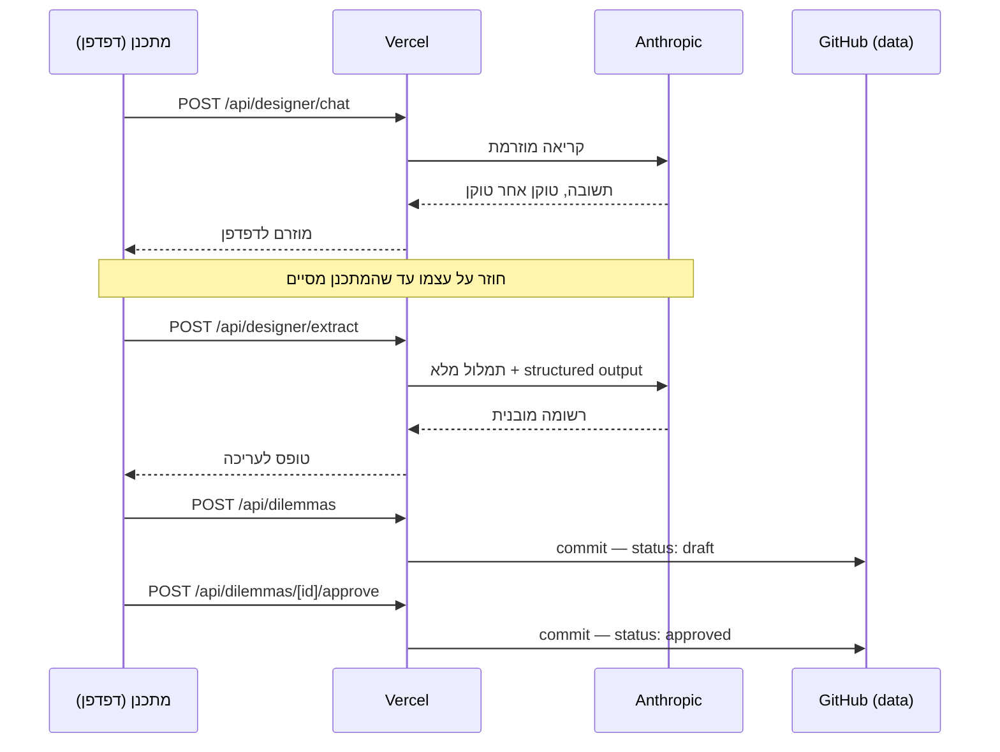
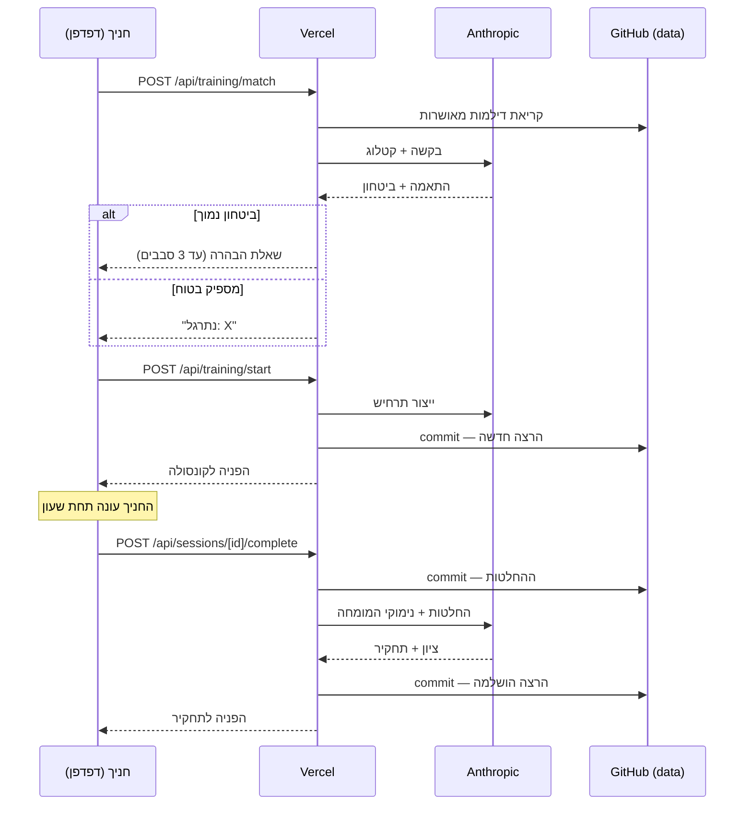

# ארכיטקטורת הפרויקט

מסמך ייחוס לסימולטור האימון להגנה אווירית. מתאר מה רץ איפה, איך המידע זורם,
איפה הוא נשמר, ולמה ההחלטות התקבלו כך.

---

## 1. שלושת השירותים

המערכת מורכבת משלושה שירותים חיצוניים בלבד. אין מסד נתונים ואין שרת קבצים.

| שירות | תפקיד | מה נשמר שם |
|---|---|---|
| **GitHub** | מאחסן את הקוד **וגם את כל המידע** | קוד המקור, דילמות, מרשם חניכים, כל הרצת אימון |
| **Vercel** | מריץ את האפליקציה | שום מידע. רק הסודות, כמשתני סביבה |
| **Anthropic API** | מנוע ה-AI | שום דבר. כל קריאה עומדת בפני עצמה |

**העיקרון המרכזי:** Vercel היא רק מנוע הרצה. אם היא נמחקת מחר, שום מידע לא הולך
לאיבוד — הכל יושב בגיטהאב. אפשר לחבר פלטפורמה אחרת ולהמשיך.

### למה אין מסד נתונים

Vercel מריצה קוד ב-serverless: אין דיסק לכתיבה, וכל בקשה עלולה לרוץ על מכונה
אחרת. לכן קובץ SQLite מקומי לא היה שורד. במקום להוסיף שירות רביעי (Turso,
Postgres), הכל נכתב לגיטהאב דרך ה-API שלו — מנגנון אחסון אחד לכל המערכת, בלי
הרשמות ובלי סודות נוספים לתחזק.

**המחיר:** כתיבה לוקחת כשנייה, והרצת אימון אחת יוצרת שלושה קומיטים.
**התמורה:** היסטוריה מלאה וניתנת לבדיקה של הידע המבצעי ושל כל אימון שנגזר ממנו.

---

## 2. שלושת הענפים

| ענף | תוכן | מי כותב אליו |
|---|---|---|
| `main` | **הקוד.** Vercel בונה מכאן | מיזוגים מענף הפיתוח |
| `claude/air-defense-simulator-bwmstp` | ענף פיתוח | Claude, בזמן עבודה |
| `data` | **כל המידע** שהאפליקציה שומרת | האפליקציה עצמה, בזמן ריצה |

### למה המידע בענף נפרד

Vercel בונה מחדש בכל דחיפה ל-`main`. אילו האפליקציה הייתה כותבת את ההרצות
לשם, **כל אימון היה מפעיל שלוש בניות מחדש** — שריפת מכסת בנייה ורעש מיותר.

הפרדת המידע לענף `data` מנתקת את הקשר: המידע נשמר בגיטהאב כמו שנדרש, והבנייה
מופעלת רק כששינוי קוד אמיתי מגיע ל-`main`.

הענף שאליו האפליקציה כותבת נקבע ע"י משתנה הסביבה `GITHUB_BRANCH`.

---

## 3. מבנה המידע בענף `data`

```
data/
├── kb/                          ← בסיס הידע
│   ├── dilemmas/
│   │   └── <uuid>.json          ← דילמה אחת לקובץ
│   └── gui/
│       ├── template.json        ← תבנית הקונסולה המדומה
│       └── screenshots/         ← צילומי הייחוס שהועלו
├── sessions/
│   └── <uuid>.json              ← הרצת אימון אחת לקובץ
└── trainees.json                ← מרשם החניכים
```

### מה יש בקובץ דילמה

| שדה | תפקיד |
|---|---|
| `title`, `sub_domain_tag` | זיהוי |
| `trigger_conditions` | **משטח ההתאמה** — הטקסט שמנוע ההתאמה קורא כדי להחליט אם בקשת חניך מתאימה לדילמה הזו |
| `key_variables` | הטווחים שבתוכם נוצר כל תרחיש: מספר איומים, חלון זמן, רמות ודאות IFF, משאבים |
| `decision_points[]` | נקודות ההכרעה. לכל אחת: מצב, פעולות אפשריות, הפעולה המועדפת, **הנימוק**, וטעויות נפוצות |
| `difficulty_scaling` | איך אותה דילמה מתהדקת בקל/בינוני/קשה |
| `evaluation_criteria` | מה נחשב הצלחה, ואיך מנקדים |
| `status` | `draft` או `approved` — **רק מאושרות נגישות לחניכים** |
| `source_chat_log` | תמלול שיחת הלימוד המקורית, לביקורת |

> **`rationale` ו-`common_errors` הם חומר הגלם של התחקיר.** התחקיר מצטט אותם
> מילה במילה לחניך. שדה מעורפל שם מייצר תחקיר חסר ערך — וזה לא נראה כמו באג,
> אלא כמו AI לא מוצלח.

---

## 4. חמש נקודות המגע עם ה-AI

לכל אחת **system prompt נפרד ומשלה**. אין פרומפט כללי אחד.

| # | מודול | קלט | פלט |
|---|---|---|---|
| 1 | `learn-dilemma.ts` — ראיון | שיחה חופשית | תשובה מוזרמת. **אף פעם לא JSON** |
| 2 | `learn-dilemma.ts` — חילוץ | תמלול מלא | רשומת דילמה מובנית |
| 3 | `match-dilemma.ts` | בקשת חניך + קטלוג | id + רמת ביטחון + שאלת הבהרה |
| 4 | `generate-scenario.ts` | דילמה + רמת קושי | תרחיש קונקרטי |
| 5 | `debrief.ts` | החלטות + הידע | ציון + טקסט תחקיר |

### שתי החלטות שכדאי לזכור

**למה הלימוד מפוצל לשתי קריאות (1 ו-2).** מראיין שצריך להחזיק סכמת JSON בראש
תוך כדי שיחה הוא מראיין גרוע. הקריאה הראשונה רק מראיינת; השנייה קוראת את
התמלול ובונה את הרשומה — פעם אחת, בסוף.

**למה התחקיר כבול לבסיס הידע (5).** ה-system prompt קובע מפורשות שהנימוק של
המומחה הוא הסמכות — לא דעתו של המודל על הגנה אווירית. מודל שיטען טענה מנומקת
אך לא מאושרת ילמד את החניך משהו שהמומחה מעולם לא אישר.

### מצב Mock

בלי `ANTHROPIC_API_KEY` המערכת עוברת אוטומטית למצב דמה: כל המסכים עובדים
ולחיצים, וכל תשובת AI היא טקסט קבוע **המסומן ככזה**. מאפשר לבדוק את הזרימה
בלי לשרוף קרדיטים, ומונע מצב שבו מפתח חסר מתגלה כשגיאה סתומה.

---

## 5. זרימת מידע — לימוד דילמה



**נקודת הבקרה:** הרשומה מוצגת כטופס שכל שדה בו ניתן לעריכה. זו רשת הביטחון של
המערכת כולה — חילוץ יכול לפרש מומחה לא נכון, וכאן זה נתפס, לפני שהרשומה
מתחילה לייצר אימונים לאנשים אחרים.

**האישור הוא פעולה נפרדת ומכוונת**, לא תוצר לוואי של שמירה. רק `approved`
נגישה לחניכים.

---

## 6. זרימת מידע — הרצת אימון



### שלוש התנהגויות מכוונות

**סף ביטחון 0.6.** מתחתיו נשאלת שאלת הבהרה. הסיבה: הכשלים א-סימטריים —
אימון על הדילמה הלא נכונה מבזבז מפגש ומלמד לקח שגוי, ושאלה נוספת עולה שניות.
אחרי 3 סבבים המערכת מתחייבת לקרוב ביותר ואומרת זאת במפורש.

**ההחלטות נשמרות לפני קריאת התחקיר.** אם ה-AI נכשל, אובד הניקוד — אף פעם לא
הרישום של מה שהחניך בחר.

**נגמר הזמן = ההרצה נגמרת.** השעון לא עוצר. באפס, ההרצה נסגרת עם מה שנענה,
ונקודות שלא נענו נספרות ככישלון. שעון דקורטיבי לא מאמן כלום.

---

## 7. שכבות הקוד

```
src/
├── app/
│   ├── page.tsx              בורר תפקידים + לוח סטטוס
│   ├── designer/             מסך 1
│   ├── trainee/              מסכים 3 ו-4
│   ├── instructor/           מסך 2
│   └── api/                  כל הקריאות מהדפדפן
├── components/               רכיבי UI
└── lib/
    ├── config.ts             ← המודול היחיד שקורא process.env
    ├── domain/schemas.ts     ← הגדרת המודל, פעם אחת
    ├── ai/
    │   ├── client.ts         ← המודול היחיד שמדבר עם Anthropic
    │   └── tasks/            מודול לכל משימה, פרומפט משלו
    └── store/
        ├── repo-files.ts     ← גיט כמדיום אחסון
        ├── kb.ts             דילמות ותבנית הקונסולה
        └── sessions.ts       הרצות ומרשם חניכים
```

### שלוש נקודות חנק מכוונות

**`config.ts`** — המקום היחיד שקורא משתני סביבה. מה שהמערכת צריכה כדי לרוץ
ניתן לענות בקריאת קובץ אחד.

**`ai/client.ts`** — המקום היחיד שמדבר עם Anthropic. מודולי המשימות מחזיקים
פרומפטים; הקובץ הזה מחזיק תעבורה.

**`domain/schemas.ts`** — הגדרת המודל פעם אחת, כ-Zod. אותה הגדרה משמשת גם
לוולידציה וגם כפורמט הפלט המובנה מול Claude. **בלי זה הפרומפט והמפרסר יכולים
להיפרד זה מזה בלי שאף אחד ישים לב.**

### `repo-files.ts` — גיט כמדיום אחסון

ממשק אחד, שתי מימושים שנבחרים בזמן ריצה:

- **GitHub Contents API** — כשמוגדרים `GITHUB_TOKEN` + `GITHUB_REPO`. כל שמירה
  היא קומיט אמיתי. זה מה שרץ ב-Vercel.
- **מערכת קבצים מקומית** — אחרת. זה מה שרץ בפיתוח מקומי.

הקוד הקורא לא יודע באיזה מימוש הוא משתמש.

---

## 8. משתני הסביבה

מוגדרים ב-Vercel בלבד. **אף אחד מהם לא נמצא בקוד ולא מגיע לדפדפן.**

| משתנה | בלעדיו |
|---|---|
| `ANTHROPIC_API_KEY` | המערכת עוברת למצב mock. הכל לחיץ, שום תשובה אמיתית |
| `GITHUB_TOKEN` | נפילה למערכת קבצים — **ובענן היא לקריאה בלבד, אז שום שמירה לא שורדת** |
| `GITHUB_REPO` | כנ"ל. הפורמט: `nimrodekel-hub/AD_SIMULATOR` |
| `GITHUB_BRANCH` | ברירת מחדל לענף הפיתוח. **צריך להיות `data`** |
| `ANTHROPIC_MODEL` | ברירת מחדל `claude-opus-5`. אופציונלי |
| `AI_MOCK` | `1` כופה מצב דמה גם עם מפתח. אופציונלי |

**איך לבדוק שהכל נקלט:** עמוד הבית מציג לוח סטטוס. שורת *AI engine* צריכה
להראות את שם המודל בירוק, ושורת *Storage* צריכה להראות `Git`. כל דבר בכתום
או אדום מצביע על משתנה חסר.

---

## 9. שתי שפות עיצוב

| קבוצה | מסכים | סגנון | למה |
|---|---|---|---|
| **ops** | חניך, מדריך | צפוף, קווים חדים, מונוספייס, זוהר עדין | נקראים תחת לחץ זמן. צפיפות המידע היא חלק מהאימון |
| **work** | מתכנן, תחקיר | מרווח, שקט, טקסט קריא | נקראים תוך כדי חשיבה |

שתיהן מוגדרות כערכות tokens ב-`src/app/globals.css`. מסך בוחר קבוצה ע"י עטיפה
ב-`.theme-ops` או `.theme-work` — **אף רכיב לא יודע באיזו קבוצה הוא נמצא.**

צבעי הסטטוס (ירוק/כתום/אדום) **זהים בשתי הקבוצות במכוון**: מפעיל שלמד
ש"כתום = מושבת" בקונסולה לא צריך ללמוד את זה מחדש בתחקיר.

---

## 10. מה שלא נבנה, ולמה

לפי הגדרת ה-POC:

- אין ייצור GUI בזמן ריצה — הקונסולה נבנית פעם אחת ונשמרת כתבנית
- אין העלאת וידאו — רק תמונות סטטיות
- אין תחומי דילמה מרובים — רק תעדוף תחת ריבוי איומים
- אין אישור מדריך פר-הרצה — האישור קורה פעם אחת ברמת בסיס הידע
- אין ניקוד מבוסס-תהליך — ניקוד מבוסס תוצאה בלבד
- **אין מערכת הזדהות**

> ⚠️ **המשמעות של היעדר הזדהות:** כל מי שיש לו את הקישור יכול להריץ אימונים —
> כלומר לצרוך קרדיטים של Anthropic ולכתוב קומיטים לריפו. אין שם מידע רגיש,
> אבל יש חשבון שמישהו משלם עליו. לפני שיתוף רחב כדאי להוסיף שכבת סיסמה.

---

## 11. קריטריון ההצלחה

ה-POC מצליח אם: מתכנן מלמד 4 דילמות דרך הממשק, חניך מבקש תרגול בשפה חופשית
לכל אחת מהן בנפרד, המערכת מתאימה נכון (או שואלת הבהרה נכונה כשמעורפל),
מייצרת תרחיש שבעל רקע מבצעי מזהה כאמין, והתחקיר משקף נכון את מה שקרה.

**ההנחה הקריטית שנבדקת:** האם מנוע AI המוזן בידע מבצעי מובנה יכול להבין בקשה
חופשית, להתאים אותה לידע הנכון, ולייצר ממנה תרחיש אמין. כל השאר משני לה.
