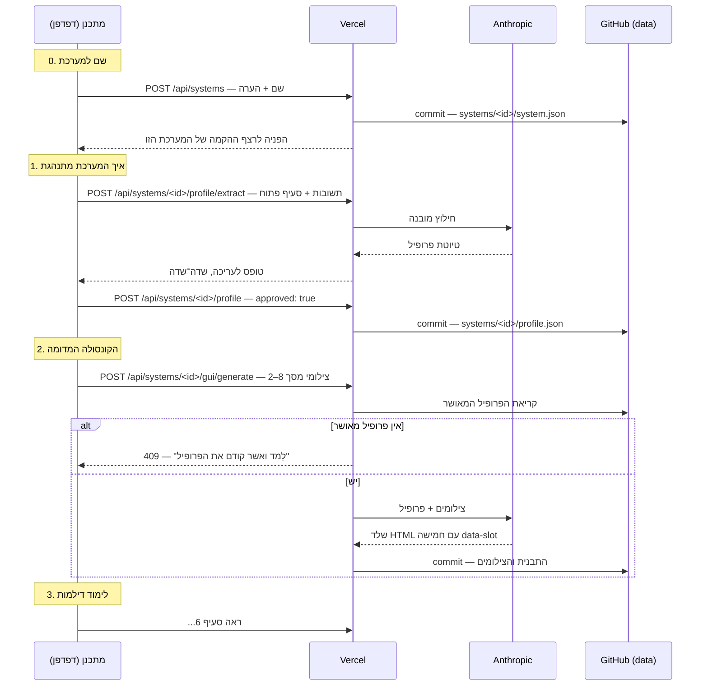
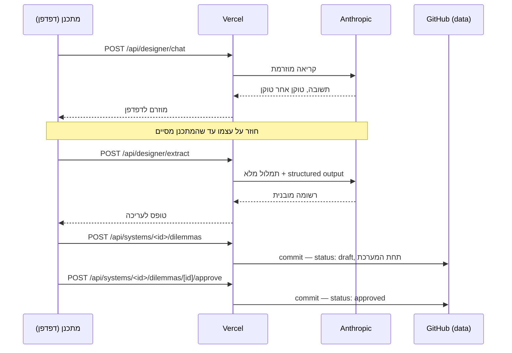
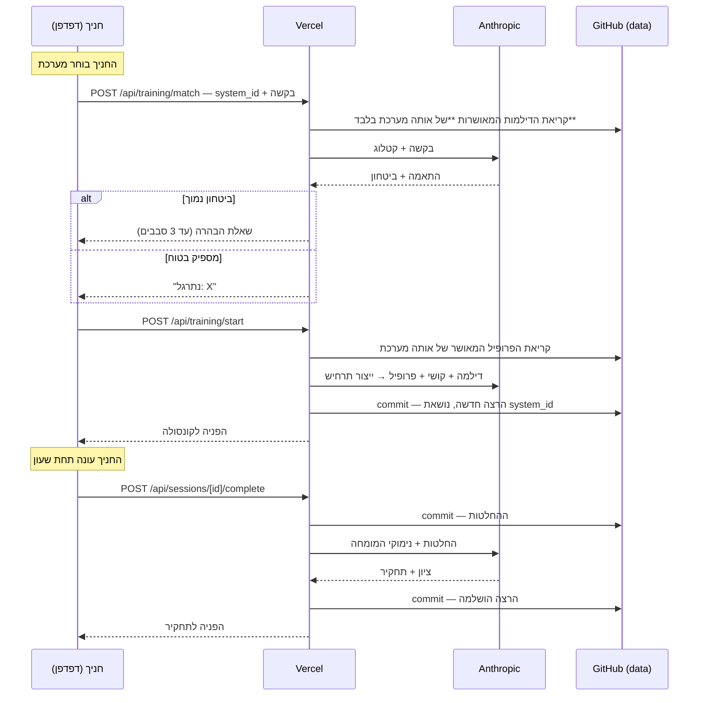

# ארכיטקטורת הפרויקט

מסמך ייחוס לסימולטור האימון להגנה אווירית. מתאר מה רץ איפה, איך המידע זורם,
איפה הוא נשמר, ולמה ההחלטות התקבלו כך.

---

## 1. שלושת השירותים

המערכת מורכבת משלושה שירותים חיצוניים בלבד. אין מסד נתונים ואין שרת קבצים.

| שירות | תפקיד | מה נשמר שם |
|---|---|---|
| **GitHub** | מאחסן את הקוד **וגם את כל המידע** | קוד המקור, דילמות, מרשם חניכים, כל הרצת אימון |
| **Vercel** | מריץ את האפליקציה | שום מידע. רק הסודות, כמשתני סביבה |
| **Anthropic API** | מנוע ה-AI | שום דבר. כל קריאה עומדת בפני עצמה |

**העיקרון המרכזי:** Vercel היא רק מנוע הרצה. אם היא נמחקת מחר, שום מידע לא הולך
לאיבוד — הכל יושב בגיטהאב. אפשר לחבר פלטפורמה אחרת ולהמשיך.

### למה אין מסד נתונים

Vercel מריצה קוד ב-serverless: אין דיסק לכתיבה, וכל בקשה עלולה לרוץ על מכונה
אחרת. לכן קובץ SQLite מקומי לא היה שורד. במקום להוסיף שירות רביעי (Turso,
Postgres), הכל נכתב לגיטהאב דרך ה-API שלו — מנגנון אחסון אחד לכל המערכת, בלי
הרשמות ובלי סודות נוספים לתחזק.

**המחיר:** כתיבה לוקחת כשנייה, והרצת אימון אחת יוצרת שלושה קומיטים.
**התמורה:** היסטוריה מלאה וניתנת לבדיקה של הידע המבצעי ושל כל אימון שנגזר ממנו.

---

## 2. שלושת הענפים

| ענף | תוכן | מי כותב אליו |
|---|---|---|
| `main` | **הקוד.** Vercel בונה מכאן | מיזוגים מענף הפיתוח |
| `claude/air-defense-simulator-bwmstp` | ענף פיתוח | Claude, בזמן עבודה |
| `data` | **כל המידע** שהאפליקציה שומרת | האפליקציה עצמה, בזמן ריצה |

### למה המידע בענף נפרד

Vercel בונה מחדש בכל דחיפה ל-`main`. אילו האפליקציה הייתה כותבת את ההרצות
לשם, **כל אימון היה מפעיל שלוש בניות מחדש** — שריפת מכסת בנייה ורעש מיותר.

הפרדת המידע לענף `data` מנתקת את הקשר: המידע נשמר בגיטהאב כמו שנדרש, והבנייה
מופעלת רק כששינוי קוד אמיתי מגיע ל-`main`.

הענף שאליו האפליקציה כותבת נקבע ע"י משתנה הסביבה `GITHUB_BRANCH`.

---

## 3. מבנה המידע בענף `data`

```
data/
├── kb/
│   └── systems/
│       └── <system-id>/         ← מערכת מדומה אחת
│           ├── system.json      ← זהות: שם, הערה, מתי נוצרה
│           ├── profile.json     ← איך היא מתנהגת
│           ├── gui.json         ← תבנית הקונסולה שלה
│           ├── screenshots/     ← צילומי הייחוס שהועלו
│           └── dilemmas/
│               └── <uuid>.json  ← דילמה שנלמדה בתוך המערכת הזו
├── sessions/
│   └── <uuid>.json              ← הרצת אימון אחת לקובץ, כולל מזהה המערכת
└── trainees.json                ← מרשם החניכים
```

### למה כל מערכת בתיקייה משלה

**המערכות עצמאיות זו מזו.** אפשר להחזיק כמה מערכות מדומות במקביל, ולהתחיל
מערכת שנייה לפני שהראשונה הושלמה. כל מה שהגיוני רק בתוך מערכת מסוימת יושב
תחתיה.

**דילמה שייכת למערכת, ולא למאגר משותף.** המספרים שלה, מצבי הזיהוי שהיא מניחה
והפעולות שהיא מציעה נכונים רק בתוך מערכת אחת. דילמה שנלמדה על מערכת א׳ לעולם
לא תוצע כשמתאמנים על מערכת ב׳ — אחרת החניך היה מתאמן על נוהל שהקונסולה שלו לא
מכירה. לכן **החניך בוחר מערכת לפני שהוא מבקש אימון**, וההתאמה מחפשת רק בדילמות
המאושרות של אותה מערכת.

**ההפרדה גם זולה יותר לקריאה:** רשימת הדילמות של מערכת אחת היא קריאת תיקייה
אחת, ולא סריקה של כל הדילמות בריפו.

**השם הוא של המתכנן, לא של המודל.** הוא ניתן בעת יצירת המערכת, מופיע בקונסולה
ובכל פרומפט, והמודל לא ממציא ולא משנה אותו.

### מה יש בפרופיל המערכת

הקובץ הזה הוא **התשתית שכל השאר עומד עליה**. דילמה היא שיקול דעת *בתוך* מערכת,
ולכן אי אפשר ללמד דילמות לפני שהמערכת עצמה מתוארת. בלי הפרופיל המודל ממציא
מערכת הגנה אווירית: הוא מנחש אילו סיווגים קיימים, מה הופך נתיב לעוין, ומה
המפעיל רשאי לעשות — והתרחישים שיוצאים **נראים נכון בלי להיות נכונים**. זה מצב
הכשל הגרוע ביותר במאמן, כי אף אחד לא רואה אותו.

| שדה | תפקיד |
|---|---|
| `purpose` | מה המערכת מגנה עליו ומפני מה. **השם אינו כאן** — הוא ב-`system.json`, ניתן ע"י המתכנן |
| `track_classifications[]` | כל סוג נתיב שהמפעיל מבחין בו, עם תחומי מהירות וגובה. **התרחיש מוגבל לרשימה הזו** |
| `iff_states[]` | מצבי הזיהוי הקיימים, מה מכניס נתיב לכל אחד, ו-`tone` שממפה אותו לצבע בקונסולה |
| `track_readout_fields[]` | **עמודות התצוגה**, בסדר ובניסוח של המערכת האמיתית. כל נתיב בתרחיש נושא בדיוק קריאה אחת לכל שדה, באותו סדר |
| `engagement` | מעטפת הירי: טווח מזערי ומרבי, זמן טיסה, כמה ירוטים במקביל, ומי מוסמך לאשר |
| `operator_responsibilities[]` | מה המפעיל מחליט. **רק מכאן נגזרות נקודות ההכרעה** |
| `automatic_functions[]` | מה המערכת עושה לבד. תרחיש לא יבקש מהחניך לעשות את זה, והקונסולה לא תציג לזה כפתור |
| `workflow_steps[]` | סדר הפעולות בפועל — קובע כמה מקום נדרש בפאנל ההכרעה |
| `source_answers[]` | התשובות המקוריות של המתכנן, לביקורת |
| `approved` | **רק פרופיל מאושר מנהל ייצור תרחישים.** טיוטה = המתכנן עדיין באמצע |
| `id` | זהה למזהה המערכת — פרופיל אחד לכל מערכת |

> **אישור נחסם אם חסרה אחת משלוש הרשימות** — סיווגים, מצבי זיהוי, שדות תצוגה.
> בלעדיהן אי אפשר לבנות לא קונסולה ולא תרחיש, ועדיף להיעצר כאן מאשר להיכשל
> אחר כך במקום שאי אפשר לאתר.

### מה יש בקובץ דילמה

| שדה | תפקיד |
|---|---|
| `title`, `sub_domain_tag` | זיהוי |
| `trigger_conditions` | **משטח ההתאמה** — הטקסט שמנוע ההתאמה קורא כדי להחליט אם בקשת חניך מתאימה לדילמה הזו |
| `key_variables` | הטווחים שבתוכם נוצר כל תרחיש: מספר איומים, חלון זמן, רמות ודאות IFF, משאבים |
| `decision_points[]` | נקודות ההכרעה. לכל אחת: מצב, פעולות אפשריות, הפעולה המועדפת, **הנימוק**, וטעויות נפוצות |
| `difficulty_scaling` | איך אותה דילמה מתהדקת בקל/בינוני/קשה |
| `evaluation_criteria` | מה נחשב הצלחה, ואיך מנקדים |
| `status` | `draft` או `approved` — **רק מאושרות נגישות לחניכים** |
| `system_id` | **המערכת שבתוכה נלמדה.** רק היא תציע את הדילמה הזו |
| `source_chat_log` | תמלול שיחת הלימוד המקורית, לביקורת |

> **`rationale` ו-`common_errors` הם חומר הגלם של התחקיר.** התחקיר מצטט אותם
> מילה במילה לחניך. שדה מעורפל שם מייצר תחקיר חסר ערך — וזה לא נראה כמו באג,
> אלא כמו AI לא מוצלח.

---

## 4. נקודות המגע עם ה-AI

לכל אחת **system prompt נפרד ומשלה**. אין פרומפט כללי אחד.

| # | מודול | קלט | פלט |
|---|---|---|---|
| 1 | `learn-system.ts` | תשובות לשאלות המכוונות + הסעיף הפתוח | פרופיל התנהגות מובנה |
| 2 | `learn-dilemma.ts` — ראיון | שיחה חופשית | תשובה מוזרמת. **אף פעם לא JSON** |
| 3 | `learn-dilemma.ts` — חילוץ | תמלול מלא | רשומת דילמה מובנית |
| 4 | `match-dilemma.ts` | בקשת חניך + קטלוג | id + רמת ביטחון + שאלת הבהרה |
| 5 | `generate-scenario.ts` | דילמה + רמת קושי + **פרופיל המערכת** | תרחיש קונקרטי |
| 6 | `generate-gui.ts` | צילומי מסך + **פרופיל המערכת** | שלד HTML של הקונסולה |
| 7 | `debrief.ts` | החלטות + הידע | ציון + טקסט תחקיר |

### שלוש החלטות שכדאי לזכור

**למה הפרופיל נאסף בטופס ולא בשיחה (1).** דילמה חיה בשיקול הדעת של המומחה
וצריך לחלץ אותה בשיחה; התנהגות המערכת היא **מפרט**, ומפרט עדיף לבקש ישירות.
שמונה שאלות מכוונות + סעיף פתוח לכל מה שהשאלות לא כיסו.

**למה הלימוד מפוצל לשתי קריאות (2 ו-3).** מראיין שצריך להחזיק סכמת JSON בראש
תוך כדי שיחה הוא מראיין גרוע. הקריאה הראשונה רק מראיינת; השנייה קוראת את
התמלול ובונה את הרשומה — פעם אחת, בסוף.

**למה התחקיר כבול לבסיס הידע (7).** ה-system prompt קובע מפורשות שהנימוק של
המומחה הוא הסמכות — לא דעתו של המודל על הגנה אווירית. מודל שיטען טענה מנומקת
אך לא מאושרת ילמד את החניך משהו שהמומחה מעולם לא אישר.

### מצב Mock

בלי `ANTHROPIC_API_KEY` המערכת עוברת אוטומטית למצב דמה: כל המסכים עובדים
ולחיצים, וכל תשובת AI היא טקסט קבוע **המסומן ככזה**. מאפשר לבדוק את הזרימה
בלי לשרוף קרדיטים, ומונע מצב שבו מפתח חסר מתגלה כשגיאה סתומה.

---

## 5. זרימת מידע — הקמת מערכת מדומה

המתכנן קודם כל **נותן שם למערכת** — ומרגע זה היא קיימת, מופיעה ברשימה, ואפשר
לעבוד עליה. אחר כך רצף של שלושה שלבים, לכל מערכת בנפרד. **הסדר אינו המלצה:**
שלב 2 חסום עד ששלב 1 אושר, ושלב 3 מזהיר במפורש שתרחישים שייבנו ממנו ירוצו מול
מערכת מומצאת כל עוד הפרופיל לא אושר.



**הקונסולה נבנית משני מקורות, לא מאחד.** הצילומים נותנים מראה — פריסה, צפיפות,
פלטה, טיפוגרפיה. הפרופיל נותן התנהגות — אילו עמודות מוצגות ובאיזה סדר, אילו
מצבי זיהוי קיימים ובאיזה צבע, וכמה בקרות דרושות לזרימת העבודה האמיתית.
**במחלוקת — הפרופיל מנצח:** הצילום מראה רגע אחד, הפרופיל מתאר את המערכת.

**קונסולה שנראית נכון ומתנהגת לא נכון מלמדת שקר.** לכן אין כפתור לפעולה
שהמערכת עושה אוטומטית, ואין עמודה שהמפעיל לא באמת קורא.

---

## 6. זרימת מידע — לימוד דילמה



**נקודת הבקרה:** הרשומה מוצגת כטופס שכל שדה בו ניתן לעריכה. זו רשת הביטחון של
המערכת כולה — חילוץ יכול לפרש מומחה לא נכון, וכאן זה נתפס, לפני שהרשומה
מתחילה לייצר אימונים לאנשים אחרים.

**האישור הוא פעולה נפרדת ומכוונת**, לא תוצר לוואי של שמירה. רק `approved`
נגישה לחניכים.

---

## 7. זרימת מידע — הרצת אימון



### חמש התנהגויות מכוונות

**התרחיש כפוף לפרופיל, לא רק לדילמה.** הדילמה קובעת *מה מתאמנים עליו*; הפרופיל
קובע *בתוך איזו מערכת*. סיווגים ומצבי זיהוי מותרים רק מהרשימות שהוצהרו, מהירות
וגובה בתוך התחומים, טווחים בתוך מעטפת הירי, ונקודות ההכרעה יכולות לבקש רק דברים
שהוגדרו כאחריות המפעיל — לא פעולות שהמערכת עושה לבד. **אם הפרופיל לא אושר,
התרחיש נוצר בלעדיו** ולוח הסטטוס אומר זאת במפורש.

**ההתאמה מוגבלת למערכת שנבחרה.** דילמה של מערכת אחרת לא תוצע, גם אם ניסוח
הבקשה מתאים לה בול — היא מניחה מצבי זיהוי ופעולות שלא קיימים בקונסולה שמולה
החניך יושב.

**סף ביטחון 0.6.** מתחתיו נשאלת שאלת הבהרה. הסיבה: הכשלים א-סימטריים —
אימון על הדילמה הלא נכונה מבזבז מפגש ומלמד לקח שגוי, ושאלה נוספת עולה שניות.
אחרי 3 סבבים המערכת מתחייבת לקרוב ביותר ואומרת זאת במפורש.

**ההחלטות נשמרות לפני קריאת התחקיר.** אם ה-AI נכשל, אובד הניקוד — אף פעם לא
הרישום של מה שהחניך בחר.

**נגמר הזמן = ההרצה נגמרת.** השעון לא עוצר. באפס, ההרצה נסגרת עם מה שנענה,
ונקודות שלא נענו נספרות ככישלון. שעון דקורטיבי לא מאמן כלום.

---

## 8. שכבות הקוד

```
src/
├── app/
│   ├── page.tsx              בורר תפקידים + לוח סטטוס
│   ├── designer/             מסך 1 — רשימת מערכות + systems/<id>/…
│   ├── trainee/              מסכים 3 ו-4
│   ├── instructor/           מסך 2
│   └── api/                  כל הקריאות מהדפדפן
├── components/               רכיבי UI
└── lib/
    ├── config.ts             ← המודול היחיד שקורא process.env
    ├── domain/schemas.ts     ← הגדרת המודל, פעם אחת
    ├── ai/
    │   ├── client.ts         ← המודול היחיד שמדבר עם Anthropic
    │   └── tasks/            מודול לכל משימה, פרומפט משלו
    └── store/
        ├── repo-files.ts     ← גיט כמדיום אחסון
        ├── kb.ts             מערכות, הפרופילים, הקונסולות והדילמות שלהן
        └── sessions.ts       הרצות ומרשם חניכים
```

### שלוש נקודות חנק מכוונות

**`config.ts`** — המקום היחיד שקורא משתני סביבה. מה שהמערכת צריכה כדי לרוץ
ניתן לענות בקריאת קובץ אחד.

**`ai/client.ts`** — המקום היחיד שמדבר עם Anthropic. מודולי המשימות מחזיקים
פרומפטים; הקובץ הזה מחזיק תעבורה.

**`domain/schemas.ts`** — הגדרת המודל פעם אחת, כ-Zod. אותה הגדרה משמשת גם
לוולידציה וגם כפורמט הפלט המובנה מול Claude. **בלי זה הפרומפט והמפרסר יכולים
להיפרד זה מזה בלי שאף אחד ישים לב.**

### `repo-files.ts` — גיט כמדיום אחסון

ממשק אחד, שתי מימושים שנבחרים בזמן ריצה:

- **GitHub Contents API** — כשמוגדרים `GITHUB_TOKEN` + `GITHUB_REPO`. כל שמירה
  היא קומיט אמיתי. זה מה שרץ ב-Vercel.
- **מערכת קבצים מקומית** — אחרת. זה מה שרץ בפיתוח מקומי.

הקוד הקורא לא יודע באיזה מימוש הוא משתמש.

---

## 9. הקמה מאפס — GitHub, Vercel וההרשאות

הפרק הזה הוא מדריך ההפעלה. הוא כתוב כדי שאפשר יהיה להקים את המערכת מאפס בלי
לנחש, ובלי לחזור על התקלות שכבר נתקלנו בהן. **כל תקלה שקרתה בפועל מסומנת כאן
כ-⚠️ עם התסמין המדויק והתיקון.**

**בסוף הפרק יש פרומפט מוכן להעתקה** — להדביק בהודעה הראשונה לסוכן שמקים
פרויקט דומה, כדי שלא יגלה מחדש את כל מה שמתועד כאן.

### מה צריך לפני שמתחילים

| # | פריט | הערה |
|---|---|---|
| 1 | חשבון GitHub שבבעלותו הריפו | הטוקן חייב להיווצר תחת **אותו חשבון** |
| 2 | חשבון Vercel | מספיק Hobby |
| 3 | מפתח Anthropic API | מ-`console.anthropic.com`, **לא** מהמנוי של Claude |

> ⚠️ **מפתח Claude אישי או עסקי אינו מפתח API.** מנוי ל-Claude ו-Anthropic API
> הם שני מוצרים עם חיוב נפרד. המפתח חייב להתחיל ב-`sk-ant-` ולהגיע מ-
> `console.anthropic.com` → **API keys**.

---

### שלב 1 — ליצור את ענף `data`

האפליקציה כותבת את כל המידע לענף נפרד. **הענף חייב להתקיים לפני השמירה
הראשונה** — כתיבה לענף שלא קיים נכשלת ב-404.

1. בריפו ב-GitHub → תפריט הענפים (`main` ▾) → **View all branches** → **New branch**
2. שם: `data`. מקור: `main`
3. **Create new branch**

> ⚠️ **Vercel מנסה לבנות כל ענף, כולל `data`.** ענף המידע מקבל קומיט בכל שמירה
> באפליקציה, וכל קומיט כזה מפעיל בנייה שנכשלת ושולחת מייל *"Failed preview
> deployment"*.
> **התיקון כבר בריפו:** הקובץ `vercel.json` בענף `data` מכיל
> `git.deploymentEnabled: { "data": false }`. Vercel קורא את הקובץ **מהענף
> שנדחף**, ולכן ההגדרה חייבת לשבת על `data` עצמו — עותק ב-`main` לא מספיק.
> אם יוצרים את `data` מחדש, לוודא שהקובץ הזה שם.

---

### שלב 2 — ליצור טוקן GitHub

זה השלב שהכי קל לטעות בו. **המסלול המדויק:**

1. `github.com` → תמונת הפרופיל → **Settings**
2. בתחתית התפריט הצדדי → **Developer settings**
3. **Personal access tokens** → **Fine-grained tokens**
4. **Generate new token**

עכשיו ממלאים:

| שדה | מה לבחור |
|---|---|
| **Token name** | כל שם, למשל `ad-simulator` |
| **Expiration** | לפי הצורך. בתפוגה הכתיבה נעצרת ויש ליצור טוקן חדש |
| **Resource owner** | החשבון שבבעלותו הריפו |
| **Repository access** | **`Only select repositories`** → לבחור **`AD_SIMULATOR`** |

> ⚠️ **`Public repositories` נותן קריאה בלבד.** זו הבחירה שנראית הכי תמימה והיא
> שוברת את הכל: היא לא מאפשרת כתיבה, **וגם לא מציגה בכלל את הקטע Repository
> permissions** — ואז נראה שאין מה להגדיר. חייבים
> `Only select repositories` + בחירת הריפו.

**ההרשאות:**

5. בקטע **Permissions** → לשונית **Repositories** → כפתור **`+`** בקצה השורה
6. לחפש **`Contents`** → לבחור **`Read and write`**
7. **Add permissions**
8. גלול לתחתית → **Generate token** (או **Update** בעריכת טוקן קיים)
9. **להעתיק את הטוקן מיד** — GitHub מציג אותו פעם אחת בלבד

בסיום צריך להיות כתוב **`Repositories 2`**: `Contents` (Read and write) ו-
`Metadata` (Read-only, נוסף אוטומטית וחובה).

> ⚠️ **כפתור ה-`+` נחתך במסך טלפון.** הוא יושב בקצה הימני של השורה האפורה
> `Repositories | Account`. בנייד: לסובב לרוחב, או פנץ׳-זום החוצה, או
> `ᴀA` → **Request Desktop Website**.

> ⚠️ **שינוי הרשאות של טוקן קיים לא משנה את ערך הטוקן.** לכן אחרי תיקון הרשאה
> **אין צורך לגעת ב-Vercel ואין צורך ב-Redeploy** — רק לרענן את הדף.
> לעומת זאת **טוקן חדש** מחייב עדכון ב-Vercel ו-Redeploy.

> 🔒 **הטוקן הוא סוד. המקום היחיד שלו הוא Vercel.** לא להדביק אותו בצ׳אט, בקוד,
> בקומיט או בהודעה — טוקן עם `Contents: Read and write` מאפשר לכל מי שמחזיק בו
> לכתוב לריפו. אם נחשף בטעות: **Revoke** מיד בעמוד הטוקנים, ליצור חדש,
> ולעדכן ב-Vercel.

---

### שלב 3 — לייבא את הפרויקט ל-Vercel

1. `vercel.com` → **Add New** → **Project**
2. **Import Git Repository** → לבחור את `AD_SIMULATOR`
3. **Framework Preset** צריך להיות **Next.js**

> ⚠️ **`No Output Directory named "public"`.** אם מייבאים את הפרויקט כשב-`main`
> עדיין אין קוד Next.js, Vercel שומר preset של אתר סטטי — והבנייה נכשלת עם
> השגיאה הזו גם אחרי שהקוד מגיע.
> **התיקון כבר בריפו:** `vercel.json` בשורש מכיל `"framework": "nextjs"`,
> שגובר על ה-preset השמור.

---

### שלב 4 — משתני הסביבה ב-Vercel

**Settings** → **Environment Variables**. מוגדרים ב-Vercel בלבד; **אף אחד מהם
לא נמצא בקוד ולא מגיע לדפדפן.**

| משתנה | ערך | בלעדיו |
|---|---|---|
| `ANTHROPIC_API_KEY` | `sk-ant-…` | המערכת עוברת למצב mock. הכל לחיץ, שום תשובה אמיתית |
| `GITHUB_TOKEN` | הטוקן משלב 2 | נפילה למערכת קבצים — **ובענן היא לקריאה בלבד, אז שום שמירה לא שורדת** |
| `GITHUB_REPO` | `nimrodekel-hub/AD_SIMULATOR` | כנ"ל. הפורמט הוא `owner/name` בדיוק |
| `GITHUB_BRANCH` | `data` | ברירת המחדל היא ענף הפיתוח. **חייב להיות `data`** |
| `ANTHROPIC_MODEL` | אופציונלי | ברירת מחדל `claude-opus-5` |
| `AI_MOCK` | אופציונלי | `1` כופה מצב דמה גם עם מפתח |

> ⚠️ **השמות רגישים לאותיות גדולות/קטנות.** `github_token` אינו `GITHUB_TOKEN`.
> זו הייתה תקלה אמיתית: המשתנים הוזנו באותיות קטנות (ואחד עם שגיאת כתיב —
> `github_brunch`), האפליקציה לא ראתה אותם, ולוח הסטטוס הראה *LOCAL FILESYSTEM*.

> ⚠️ **משתנה שסומן Sensitive אי אפשר לערוך.** מופיע לידו מנעול. במקרה כזה
> **למחוק אותו וליצור מחדש** בשם הנכון.

> ⚠️ **שינוי משתנה סביבה לא נכנס לתוקף עד בנייה חדשה.** אחרי כל שינוי:
> **Deployments** → הפריסה האחרונה → **⋯** → **Redeploy**.

---

### שלב 5 — לאמת שהכל נקלט

עמוד הבית מציג לוח סטטוס. **שלוש השורות שקובעות:**

| שורה | מה צריך להופיע | אם לא |
|---|---|---|
| **AI engine** | שם המודל בירוק | `Mock — no API key` ⇒ `ANTHROPIC_API_KEY` חסר או לא נקלט |
| **Storage** | `Git — committed to the repository` בירוק | ראה טבלת התקלות למטה |
| **Simulated systems** | `None` בהתחלה — זה תקין | — |

שורת **Storage** לא מסתפקת בכך שהמשתנים קיימים: היא **שואלת את GitHub** אם
הטוקן באמת יכול לכתוב, ואם הענף שאליו כותבים קיים. לכן ירוק שם משמעותו שהשמירה
תעבוד — ולא רק שההגדרות מולאו.

---

### טבלת תקלות — תסמין, סיבה, תיקון

| מה רואים | הסיבה | התיקון |
|---|---|---|
| `Storage: Local filesystem` | אחד ממשתני GitHub חסר או בשם שגוי | לתקן את השם המדויק ב-Vercel, ואז **Redeploy** |
| `Git — cannot write` + *"can read but not write"* | לטוקן אין `Contents: Read and write` | שלב 2, סעיפים 5–8. **בלי Redeploy** |
| `403 Resource not accessible by personal access token` בשמירה | אותה סיבה, מהצד של הכתיבה בפועל | כנ"ל |
| `401` / *"token is expired or invalid"* | הטוקן פג או בוטל | ליצור טוקן חדש, לעדכן ב-Vercel, **Redeploy** |
| `404` / *"cannot see the repository"* | `GITHUB_REPO` שגוי, או שהריפו לא נבחר בטוקן | לתקן את המשתנה או את **Repository access** של הטוקן |
| *"the branch … does not exist"* | ענף `data` לא נוצר, או `GITHUB_BRANCH` עם שגיאת כתיב | שלב 1 |
| `No Output Directory named "public"` | preset סטטי שמור ב-Vercel | לוודא ש-`vercel.json` בשורש מכיל `"framework": "nextjs"` |
| מייל *"Failed preview deployment"* בכל שמירה | Vercel בונה את ענף `data` | לוודא ש-`vercel.json` **בענף `data`** מכיל `deploymentEnabled: {"data": false}` |
| `AI engine: Mock` למרות שהוזן מפתח | שם המשתנה שגוי, או שלא נעשה Redeploy | לתקן ולבנות מחדש |

---

### מה לא נדרש

- **אין מסד נתונים להקים.** אין Turso, אין Postgres, אין חיבור נוסף.
- **אין deploy key ואין SSH.** הכתיבה עוברת ב-HTTPS דרך ה-Contents API עם הטוקן.
- **אין צורך לבטל push protection.** האפליקציה כותבת רק קבצי JSON ל-`data`.

---

### פרומפט להעתקה — כשמקימים אפליקציה דומה בפעם הבאה

הבלוק הבא נועד להיות מודבק **בהודעה הראשונה** לסוכן שמקים פרויקט חדש מהסוג
הזה. הוא מקצר את הפינג-פונג שכל הפרק הזה מתעד: הסוכן יודע מראש מה הוא בונה
לבד, מה רק בעל החשבון יכול לעשות, ואילו מלכודות אסור לו לגלות מחדש.

הוא כתוב גנרי בכוונה — לא על סימולטור הגנה אווירית אלא על התבנית: אתר Next.js
ב-Vercel, שמידע נשמר בגיטהאב, שקורא למודל.

```text
אני מקים POC: אתר Next.js שנפרס ב-Vercel, שומר את כל המידע שלו בגיטהאב,
וקורא ל-Anthropic API. אני עובד מכל מקום — שום דבר לא רץ אצלי מקומית, והקישור
לאתר צריך להיות ניתן לשליחה לאחרים. אני כותב בעברית, ענה בעברית.

ההחלטות הבאות כבר הוכרעו בפרויקט קודם, והמלכודות שמסומנות כאן כבר עלו לנו
זמן. אל תגלה אותן מחדש ואל תציע להן חלופות.

== לפני שאתה כותב קוד ==
Next.js מתקדם מהר, והגרסה שתותקן כאן כנראה חדשה יותר מזו שאתה מכיר. קרא את
המדריכים תחת node_modules/next/dist/docs לפני שאתה כותב, ובמיוחד את מה שנוגע
ל-params ו-searchParams — הם אסינכרוניים.

== הארכיטקטורה ==
1. אין מסד נתונים. המידע הוא קבצי JSON שנכתבים לענף גיט נפרד בשם data, דרך
   GitHub Contents API. כל שינוי בנתונים הוא קומיט עם היסטוריה, בלי שירות
   נוסף להקים ובלי חשבון נוסף לשלם עליו.
2. שלושה ענפים: main (מה שחי), ענף פיתוח, ו-data (רק נתונים, בלי קוד).
3. שכבת אחסון עם ממשק אחד ושני מימושים: גיטהאב לענן, מערכת קבצים לפיתוח.
   שים לב שבענן מערכת הקבצים היא לקריאה בלבד — אם נפילה לאחור קורית
   בפרודקשן, שום שמירה לא שורדת. לכן היא חייבת להיות גלויה בלוח הסטטוס.
4. Zod כמקור אמת יחיד: אותה סכימה מאמתת קלט ומגדירה את הפורמט המובנה שהמודל
   מחזיר.

== מה אתה עושה לבד, בלי לשאול אותי ==
- כל הקוד, וגם שני קבצי vercel.json:
  * בשורש: {"framework": "nextjs"} — בלעדיו, אם הייבוא ל-Vercel נעשה לפני
    שיש קוד, Vercel נועל preset של אתר סטטי והבנייה נכשלת בשגיאה
    No Output Directory named "public" גם אחרי שהקוד מגיע.
  * בענף data: {"git": {"deploymentEnabled": {"data": false}}} — בלעדיו כל
    שמירה באפליקציה מפעילה בנייה נכשלת ומייל Failed preview deployment.
    Vercel קורא את הקובץ מהענף שנדחף, ולכן עותק ב-main לא מספיק.
- ליצור את ענף data ולוודא שהוא קיים לפני השמירה הראשונה. כתיבה לענף שאינו
  קיים נכשלת ב-404.
- לוח סטטוס בעמוד הבית שבודק בפועל: לא רק שמשתני הסביבה קיימים, אלא שהטוקן
  באמת יכול לכתוב ושהענף קיים. לוח שמראה ירוק בזמן שהכתיבה שבורה גרוע מלוח
  שאין.
- לתרגם כל שגיאת אחסון למשפט שאומר מה לתקן: 403 = לטוקן אין
  Contents: Read and write. 401 = הטוקן פג או בוטל. 404 = הריפו או הענף
  לא נראים לטוקן.
- לקרוא כל תשובת fetch דרך פונקציה אחת שמנסה JSON, ואם לא הצליחה מדווחת מה
  הסטטוס אומר. הפלטפורמה שמתחת לאפליקציה מחזירה HTML ב-413, ב-502 וב-504,
  וקריאת json() על אלה זורקת שגיאת פרסר שמחליפה את הסיבה האמיתית בשטות.
- להקטין תמונות בדפדפן לפני העלאה, ל-1568 פיקסל בצלע הארוכה. מגבלת גוף
  הבקשה של Vercel היא 4.5MB ואי אפשר להגדיל אותה, ומודלים של Anthropic
  מקטינים לגודל הזה בעצמם לפני שהם קוראים את התמונה — כל פיקסל מעבר נשלח,
  משולם, ונזרק. ההקטנה צריכה להיכשל רך: קובץ שהדפדפן לא מצליח לפענח נשלח
  כמות שהוא.

== מה רק אני יכול לעשות ==
יצירת טוקן גיטהאב, ייבוא הפרויקט ל-Vercel, והזנת משתני הסביבה. כשאתה מגיע
לשם:
- תן לי את כל הצעדים בבת אחת, עם מסלול הקלקות מדויק, ולא שאלה-תשובה-שאלה.
- אני עובד גם מהטלפון. אם כפתור נחתך במסך צר, אמור לי איפה הוא ומה לעשות.
- בטוקן: Repository access חייב להיות "Only select repositories" עם בחירת
  הריפו. "Public repositories" נותן קריאה בלבד, וגם מסתיר לגמרי את קטע
  ההרשאות — ואז נראה שאין מה להגדיר. ההרשאה הדרושה היא
  Contents: Read and write.
- שינוי הרשאה של טוקן קיים לא משנה את ערך הטוקן, ולכן לא דורש עדכון
  ב-Vercel ולא Redeploy. טוקן חדש כן דורש את שניהם.
- שמות משתני סביבה רגישים לאותיות גדולות/קטנות, ושינוי שלהם לא נכנס לתוקף
  עד בנייה חדשה. תזכיר לי את שניהם, כי שניהם כבר הפילו אותנו.
- מפתח Anthropic API אינו מנוי Claude. הוא מתחיל ב-sk-ant ומגיע
  מ-console.anthropic.com.

== סודות ==
אל תבקש ממני להדביק טוקן או מפתח API בצ׳אט. אם הדבקתי בטעות — אמור לי לבטל
אותו מיד, ואל תשתמש בו. המקום היחיד של סוד הוא משתני הסביבה ב-Vercel.

== איך אנחנו עובדים ==
- אחרי כל שינוי מוגמר: קומיט, דחיפה, מיזוג ל-main, ואימות שזה עלה לאתר החי.
  אין מה לצבור עבודה בענף צדדי — האתר עדיין לא בשימוש אמיתי.
- בכל שלב, לבדוק דרך הדפדפן שהמסך באמת עובד, ולא רק שהקוד מתקמפל.
- כל מלכודת חדשה שנתקלנו בה — לתעד בקובץ הארכיטקטורה עם התסמין המדויק
  והתיקון, כדי שהפעם הבאה לא נשלם עליה שוב.
```

---

## 10. שתי שפות עיצוב

| קבוצה | מסכים | סגנון | למה |
|---|---|---|---|
| **ops** | חניך, מדריך | צפוף, קווים חדים, מונוספייס, זוהר עדין | נקראים תחת לחץ זמן. צפיפות המידע היא חלק מהאימון |
| **work** | מתכנן, תחקיר | מרווח, שקט, טקסט קריא | נקראים תוך כדי חשיבה |

שתיהן מוגדרות כערכות tokens ב-`src/app/globals.css`. מסך בוחר קבוצה ע"י עטיפה
ב-`.theme-ops` או `.theme-work` — **אף רכיב לא יודע באיזו קבוצה הוא נמצא.**

צבעי הסטטוס (ירוק/כתום/אדום) **זהים בשתי הקבוצות במכוון**: מפעיל שלמד
ש"כתום = מושבת" בקונסולה לא צריך ללמוד את זה מחדש בתחקיר.

---

## 11. מה שלא נבנה, ולמה

לפי הגדרת ה-POC:

- אין ייצור GUI בזמן ריצה — הקונסולה נבנית פעם אחת ונשמרת כתבנית
- אין העלאת וידאו — רק תמונות סטטיות
- אין תחומי דילמה מרובים — רק תעדוף תחת ריבוי איומים
- אין אישור מדריך פר-הרצה — האישור קורה פעם אחת ברמת בסיס הידע
- אין ניקוד מבוסס-תהליך — ניקוד מבוסס תוצאה בלבד
- **אין מערכת הזדהות**

> ⚠️ **המשמעות של היעדר הזדהות:** כל מי שיש לו את הקישור יכול להריץ אימונים —
> כלומר לצרוך קרדיטים של Anthropic ולכתוב קומיטים לריפו. אין שם מידע רגיש,
> אבל יש חשבון שמישהו משלם עליו. לפני שיתוף רחב כדאי להוסיף שכבת סיסמה.

---

## 12. קריטריון ההצלחה

ה-POC מצליח אם: מתכנן מלמד 4 דילמות דרך הממשק, חניך מבקש תרגול בשפה חופשית
לכל אחת מהן בנפרד, המערכת מתאימה נכון (או שואלת הבהרה נכונה כשמעורפל),
מייצרת תרחיש שבעל רקע מבצעי מזהה כאמין, והתחקיר משקף נכון את מה שקרה.

**ההנחה הקריטית שנבדקת:** האם מנוע AI המוזן בידע מבצעי מובנה יכול להבין בקשה
חופשית, להתאים אותה לידע הנכון, ולייצר ממנה תרחיש אמין. כל השאר משני לה.
